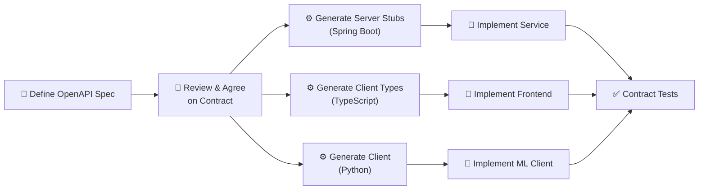
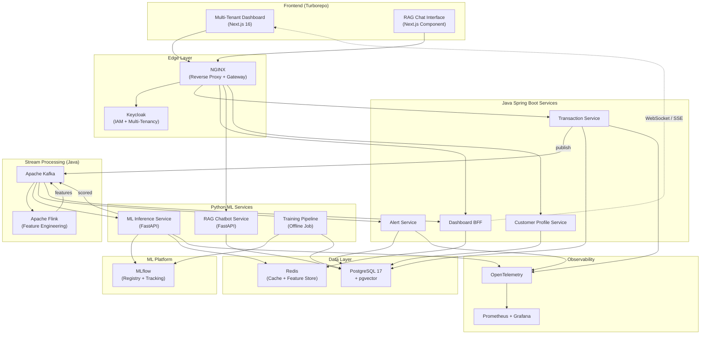
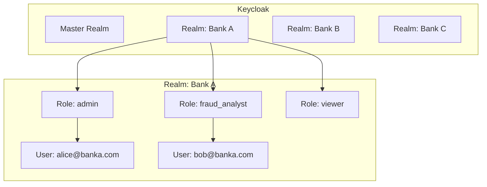
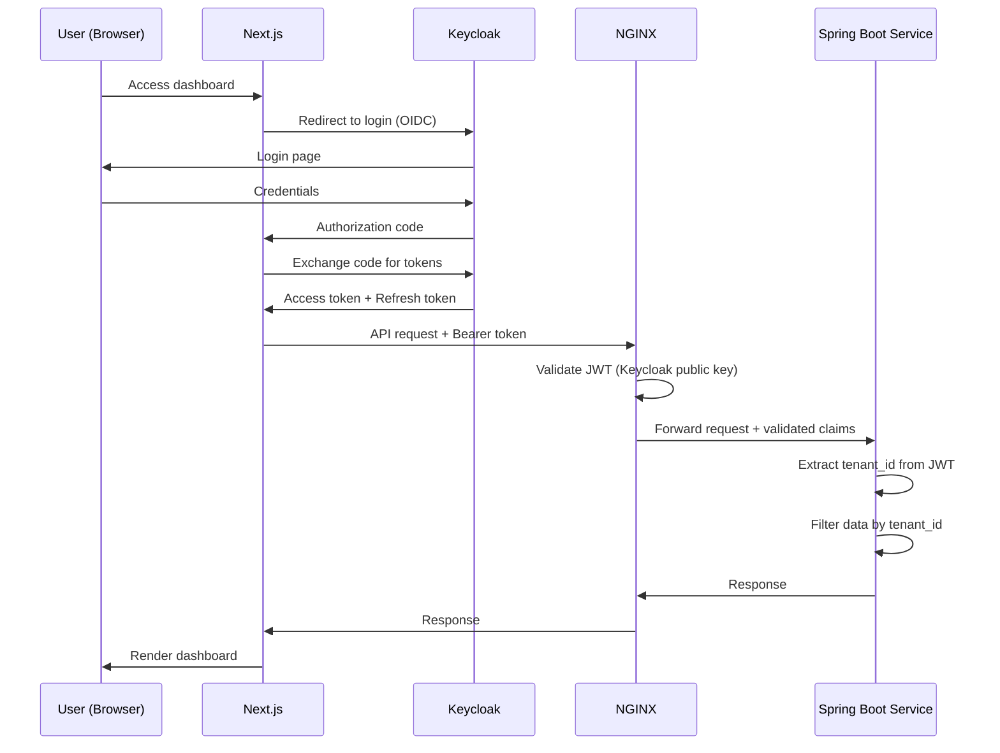
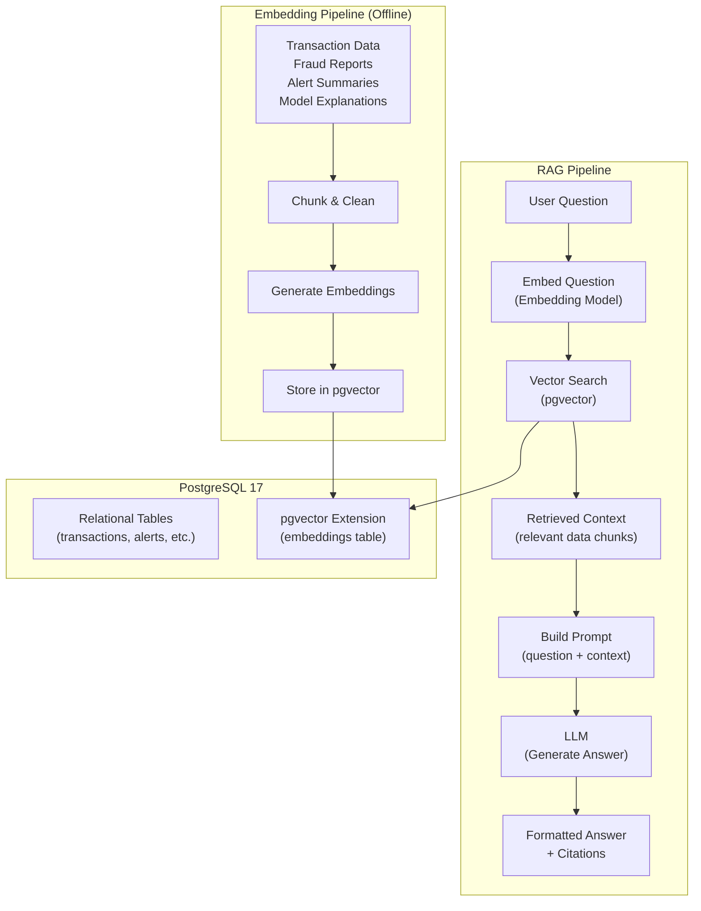

# Lynceus — Architecture Discussion (v2 — Revised)

> **Changelog from v1**: Java Spring Boot for core services, Python for ML only, Next.js 16 + Turborepo multi-tenant dashboard, Keycloak IAM, NGINX gateway, RAG chatbot with pgvector, API-first design, graph fraud detection included, load testing included.

---

## 1. The System at a Glance

**Lynceus** is a polyglot, event-driven, microservice-based fraud detection platform.

| Layer | Technology | Language |
|-------|-----------|----------|
| Core Business Services | Spring Boot 3.x | Java 21 |
| ML Services | FastAPI | Python 3.12 |
| Stream Processing | Apache Flink | Java |
| Event Bus | Apache Kafka | — |
| Frontend | Next.js 16 + Turborepo | TypeScript |
| Auth/IAM | Keycloak | — |
| API Gateway | NGINX | — |
| Primary Database | PostgreSQL 17 + pgvector | — |
| Cache / Feature Store | Redis | — |
| ML Registry | MLflow | — |
| Observability | OpenTelemetry + Prometheus + Grafana | — |

---

## 2. API-First Design Philosophy

This is the foundational principle. **Nothing gets coded before the API contract exists.**



### What This Means in Practice

| Principle | Implementation |
|-----------|---------------|
| **Specs live in `api-specs/`** | Every service has an OpenAPI 3.1 YAML spec checked into the repo |
| **Code generation** | Spring Boot controllers generated from spec (openapi-generator), TypeScript types generated for Next.js |
| **Contract testing** | CI validates that implementations match their specs (Spring Cloud Contract or Pact) |
| **Versioned APIs** | All endpoints prefixed with `/api/v1/`, breaking changes require a new version |
| **Documentation auto-generated** | Swagger UI served by each service, aggregated at gateway level |

### API Spec Structure

```
api-specs/
├── transaction-api.yaml        # Transaction Service contract
├── inference-api.yaml          # ML Inference Service contract
├── alert-api.yaml              # Alert Service contract
├── customer-api.yaml           # Customer Profile Service contract
├── chatbot-api.yaml            # RAG Chatbot Service contract
├── dashboard-bff-api.yaml      # Dashboard BFF contract
└── shared/
    ├── schemas/                # Reusable schema components
    │   ├── transaction.yaml
    │   ├── fraud-score.yaml
    │   ├── customer.yaml
    │   └── alert.yaml
    └── errors.yaml             # Standardized error responses
```

---

## 3. Revised System Architecture



---

## 4. Microservice Decomposition (Revised)

### Java Spring Boot Services

| Service | Responsibility | Why Spring Boot? |
|---------|---------------|-----------------|
| **Transaction Service** | Ingest, validate, persist transactions, publish to Kafka | High-throughput writes, Spring Kafka integration, virtual threads (Java 21) for massive concurrency |
| **Alert Service** | Consume fraud scores, evaluate rules, manage cases/escalation | Business rule engine, transactional workflows, Spring State Machine for escalation flows |
| **Customer Profile Service** | Maintain risk profiles, behavioral baselines, aggregated stats | CRUD-heavy, JPA/Hibernate for complex queries, Spring Cache for hot profiles |
| **Dashboard BFF** | Aggregate data from all services for the frontend, manage WebSocket connections | Spring WebFlux for reactive WebSocket streaming, Spring Cloud Gateway integration |

### Python ML Services

| Service | Responsibility | Why Python? |
|---------|---------------|------------|
| **ML Inference Service** | Load models, compute fraud scores, ensemble scoring | scikit-learn + PyTorch live in Python, numpy/pandas for feature manipulation |
| **RAG Chatbot Service** | Embed data, vector search, LLM-powered Q&A over fraud data | LangChain/LlamaIndex ecosystem is Python-native, pgvector integration |
| **Training Pipeline** | Offline model training, evaluation, registry push | ML training is fundamentally a Python workflow |

### Java Flink Jobs

| Job | Responsibility |
|-----|---------------|
| **Feature Engineering Job** | Real-time windowed aggregations: velocity, distance, deviation, merchant novelty |

---

## 5. Authentication & Multi-Tenancy (Keycloak)

### Multi-Tenancy Model



| Concept | Implementation |
|---------|---------------|
| **Tenant = Keycloak Realm** | Each bank client gets its own Keycloak realm with isolated users, roles, and tokens |
| **Tenant ID in JWT** | Every request carries a JWT with `realm` claim → services use this for data isolation |
| **Data isolation** | All tables include a `tenant_id` column. Queries always filter by tenant. PostgreSQL RLS enforces at DB level as safety net |
| **RBAC Roles** | `admin` (full access), `fraud_analyst` (review/action alerts), `viewer` (read-only dashboards), `ml_engineer` (model management) |

### Auth Flow



---

## 6. RAG Chatbot Architecture

### What Can Users Ask?

- *"Show me the top 10 suspicious transactions this week"*
- *"What merchant categories have the highest fraud rate?"*
- *"Explain why transaction TXN-12345 was flagged"*
- *"Compare fraud trends between Q1 and Q2"*
- *"Which customers have escalating risk profiles?"*

### How It Works



### What Gets Embedded?

| Data Source | Embedding Strategy | Update Frequency |
|------------|-------------------|-----------------|
| **Transaction summaries** | Daily aggregated summaries per merchant, customer, category | Daily batch |
| **Fraud alert descriptions** | Each alert with its explanation, score, features | On alert creation |
| **Model explanations** | SHAP explanations for flagged transactions | On scoring |
| **Fraud patterns** | Detected pattern descriptions (velocity abuse, geographic anomaly, etc.) | Weekly batch |
| **System documentation** | Runbooks, FAQs, fraud typology definitions | On change |

### pgvector Setup

```sql
-- Enable the extension
CREATE EXTENSION IF NOT EXISTS vector;

-- Embeddings table
CREATE TABLE embeddings (
    id UUID PRIMARY KEY DEFAULT gen_random_uuid(),
    tenant_id VARCHAR(50) NOT NULL,
    source_type VARCHAR(50) NOT NULL,  -- 'transaction_summary', 'alert', 'pattern', etc.
    source_id VARCHAR(100),
    content TEXT NOT NULL,
    embedding vector(1536),            -- dimension depends on model (1536 for OpenAI, 768 for smaller)
    metadata JSONB,
    created_at TIMESTAMPTZ DEFAULT NOW(),
    
    -- Tenant isolation
    CONSTRAINT fk_tenant FOREIGN KEY (tenant_id) REFERENCES tenants(id)
);

-- HNSW index for fast approximate nearest neighbor search
CREATE INDEX idx_embeddings_vector ON embeddings 
    USING hnsw (embedding vector_cosine_ops)
    WITH (m = 16, ef_construction = 64);

-- Composite index for tenant-scoped searches
CREATE INDEX idx_embeddings_tenant ON embeddings (tenant_id, source_type);
```

### SQL + Vector Hybrid Queries

The chatbot isn't pure RAG — it also has a **SQL agent** mode for structured queries:

| Question Type | Approach |
|--------------|----------|
| *"How many fraud alerts this week?"* | SQL query against relational tables |
| *"Explain why TXN-123 was flagged"* | Vector search over SHAP explanations |
| *"What are the common fraud patterns?"* | Vector search over pattern descriptions |
| *"Show transactions over $10K from New York"* | SQL query with filters |
| *"Summarize the fraud trend"* | Hybrid: SQL for data, LLM for summarization |

The chatbot service routes questions to either **SQL generation** or **vector search** based on intent classification.

---

## 7. Multi-Tenant Dashboard (Turborepo + Next.js 16)

### Turborepo Structure

```
frontend/
├── turbo.json
├── package.json
├── apps/
│   └── dashboard/                    # Main Next.js 16 app
│       ├── app/
│       │   ├── (auth)/               # Auth-gated routes
│       │   │   ├── layout.tsx        # Authenticated layout with sidebar
│       │   │   ├── overview/         # Main dashboard
│       │   │   ├── transactions/     # Transaction explorer
│       │   │   ├── alerts/           # Alert queue & case management
│       │   │   ├── customers/        # Customer risk profiles
│       │   │   ├── analytics/        # Charts, heatmaps, trends
│       │   │   ├── models/           # Model performance & A/B test results
│       │   │   └── chat/             # RAG chatbot interface
│       │   ├── (public)/             # Public routes
│       │   │   └── login/
│       │   ├── api/                  # Next.js API routes (BFF helpers)
│       │   ├── layout.tsx
│       │   └── page.tsx
│       ├── middleware.ts             # Keycloak JWT validation, tenant routing
│       ├── next.config.ts
│       └── package.json
├── packages/
│   ├── ui/                           # Shared component library
│   │   ├── components/
│   │   │   ├── charts/              # Recharts wrappers
│   │   │   ├── data-table/          # Reusable data tables
│   │   │   ├── alerts/              # Alert badges, status indicators
│   │   │   ├── chat/                # Chat UI components
│   │   │   └── layout/              # Sidebar, header, breadcrumbs
│   │   ├── hooks/                   # Shared React hooks
│   │   └── package.json
│   ├── config-eslint/               # Shared ESLint config
│   ├── config-typescript/           # Shared TSConfig
│   └── types/                       # Shared TypeScript types
│       ├── transaction.ts           # Generated from OpenAPI specs
│       ├── alert.ts
│       ├── customer.ts
│       └── package.json
```

### Multi-Tenancy in the Frontend

| Concern | Implementation |
|---------|---------------|
| **Tenant identification** | Extracted from Keycloak JWT `realm` claim in Next.js middleware |
| **Theme per tenant** | CSS custom properties scoped to tenant (colors, logo) loaded dynamically |
| **Data isolation** | All API calls include tenant context via JWT — backend enforces isolation |
| **Tenant switching** | Admin users can switch between tenants (for platform operators) |

### Dashboard Pages

| Page | Key Components | Data Source |
|------|---------------|-------------|
| **Overview** | KPI cards (total txns, fraud rate, avg score), risk distribution donut, live feed | BFF (aggregated) |
| **Transactions** | Searchable/filterable table, inline fraud score, click-to-expand details | Transaction Service |
| **Alerts** | Alert queue with severity badges, assign/resolve workflow, SLA timer | Alert Service |
| **Customers** | Risk profile cards, transaction history timeline, behavioral deviation chart | Customer Service |
| **Analytics** | Time-series fraud trend (Recharts), geographic heatmap, merchant category breakdown | BFF (aggregated) |
| **Models** | Model versions, A/B test comparison charts, precision/recall curves, drift indicators | MLflow + Inference Service |
| **Chat** | Chat interface, suggested questions, citation links to source data | RAG Chatbot Service |

---

## 8. PostgreSQL 17 — Full Data Model

Single PostgreSQL instance, table-based tenant isolation with `tenant_id` on every table.

### Core Tables

```sql
-- All tables include tenant_id for isolation
-- RLS policies enforce tenant scoping as a safety net

-- ============================================
-- TRANSACTIONS
-- ============================================
CREATE TABLE transactions (
    id UUID PRIMARY KEY DEFAULT gen_random_uuid(),
    tenant_id VARCHAR(50) NOT NULL,
    customer_id UUID NOT NULL,
    amount DECIMAL(15, 2) NOT NULL,
    currency VARCHAR(3) DEFAULT 'USD',
    merchant_name VARCHAR(255),
    merchant_category VARCHAR(100),
    merchant_id VARCHAR(100),
    location_lat DECIMAL(10, 7),
    location_lng DECIMAL(10, 7),
    country_code VARCHAR(3),
    is_online BOOLEAN DEFAULT FALSE,
    is_foreign BOOLEAN DEFAULT FALSE,
    channel VARCHAR(50),               -- 'pos', 'atm', 'online', 'mobile'
    device_id VARCHAR(100),
    ip_address INET,
    metadata JSONB,
    created_at TIMESTAMPTZ DEFAULT NOW(),
    
    -- Generated column for amount bucketing
    amount_bucket VARCHAR(20) GENERATED ALWAYS AS (
        CASE 
            WHEN amount < 50 THEN 'micro'
            WHEN amount < 500 THEN 'small'
            WHEN amount < 5000 THEN 'medium'
            WHEN amount < 50000 THEN 'large'
            ELSE 'whale'
        END
    ) STORED
) PARTITION BY RANGE (created_at);

-- Monthly partitions
CREATE TABLE transactions_2026_07 PARTITION OF transactions
    FOR VALUES FROM ('2026-07-01') TO ('2026-08-01');
CREATE TABLE transactions_2026_08 PARTITION OF transactions
    FOR VALUES FROM ('2026-08-01') TO ('2026-09-01');

-- Indexes
CREATE INDEX idx_txn_tenant_customer ON transactions (tenant_id, customer_id);
CREATE INDEX idx_txn_tenant_created ON transactions (tenant_id, created_at DESC);
CREATE INDEX idx_txn_merchant_cat ON transactions (tenant_id, merchant_category);
CREATE INDEX idx_txn_metadata ON transactions USING GIN (metadata);

-- ============================================
-- FRAUD SCORES
-- ============================================
CREATE TABLE fraud_scores (
    id UUID PRIMARY KEY DEFAULT gen_random_uuid(),
    tenant_id VARCHAR(50) NOT NULL,
    transaction_id UUID NOT NULL REFERENCES transactions(id),
    isolation_forest_score DECIMAL(5, 4),
    autoencoder_score DECIMAL(5, 4),
    ensemble_score DECIMAL(5, 4) NOT NULL,
    risk_level VARCHAR(20) NOT NULL,   -- 'low', 'medium', 'high', 'critical'
    model_version VARCHAR(50),
    feature_vector JSONB,              -- snapshot of features used
    explanation JSONB,                 -- SHAP values / top contributing factors
    scored_at TIMESTAMPTZ DEFAULT NOW()
);

-- ============================================
-- ALERTS
-- ============================================
CREATE TABLE alerts (
    id UUID PRIMARY KEY DEFAULT gen_random_uuid(),
    tenant_id VARCHAR(50) NOT NULL,
    transaction_id UUID NOT NULL,
    fraud_score_id UUID NOT NULL,
    severity VARCHAR(20) NOT NULL,     -- 'low', 'medium', 'high', 'critical'
    status VARCHAR(20) DEFAULT 'open', -- 'open', 'investigating', 'confirmed_fraud', 'false_positive', 'closed'
    assigned_to VARCHAR(100),
    resolution_notes TEXT,
    created_at TIMESTAMPTZ DEFAULT NOW(),
    updated_at TIMESTAMPTZ DEFAULT NOW(),
    resolved_at TIMESTAMPTZ,
    sla_deadline TIMESTAMPTZ           -- auto-computed based on severity
);

-- ============================================
-- CUSTOMERS
-- ============================================
CREATE TABLE customers (
    id UUID PRIMARY KEY DEFAULT gen_random_uuid(),
    tenant_id VARCHAR(50) NOT NULL,
    external_id VARCHAR(100) NOT NULL,
    name VARCHAR(255),
    email VARCHAR(255),
    phone VARCHAR(50),
    risk_score DECIMAL(5, 4) DEFAULT 0.0,
    risk_level VARCHAR(20) DEFAULT 'low',
    avg_transaction_amount DECIMAL(15, 2),
    total_transactions BIGINT DEFAULT 0,
    total_fraud_alerts BIGINT DEFAULT 0,
    home_location_lat DECIMAL(10, 7),
    home_location_lng DECIMAL(10, 7),
    profile_metadata JSONB,
    created_at TIMESTAMPTZ DEFAULT NOW(),
    updated_at TIMESTAMPTZ DEFAULT NOW(),
    
    UNIQUE(tenant_id, external_id)
);

-- ============================================
-- EMBEDDINGS (pgvector)
-- ============================================
CREATE TABLE embeddings (
    id UUID PRIMARY KEY DEFAULT gen_random_uuid(),
    tenant_id VARCHAR(50) NOT NULL,
    source_type VARCHAR(50) NOT NULL,
    source_id VARCHAR(100),
    content TEXT NOT NULL,
    embedding vector(1536),
    metadata JSONB,
    created_at TIMESTAMPTZ DEFAULT NOW()
);

CREATE INDEX idx_embeddings_vector 
    ON embeddings USING hnsw (embedding vector_cosine_ops);

-- ============================================
-- MATERIALIZED VIEWS (pre-computed aggregations)
-- ============================================
CREATE MATERIALIZED VIEW mv_daily_fraud_stats AS
SELECT 
    tenant_id,
    DATE(t.created_at) AS date,
    COUNT(*) AS total_transactions,
    COUNT(*) FILTER (WHERE fs.risk_level IN ('high', 'critical')) AS flagged_count,
    AVG(fs.ensemble_score) AS avg_fraud_score,
    PERCENTILE_CONT(0.95) WITHIN GROUP (ORDER BY fs.ensemble_score) AS p95_fraud_score,
    SUM(t.amount) AS total_amount,
    SUM(t.amount) FILTER (WHERE fs.risk_level IN ('high', 'critical')) AS flagged_amount
FROM transactions t
JOIN fraud_scores fs ON fs.transaction_id = t.id AND fs.tenant_id = t.tenant_id
GROUP BY t.tenant_id, DATE(t.created_at);

-- Refresh schedule (via pg_cron or application-level scheduler)
-- REFRESH MATERIALIZED VIEW CONCURRENTLY mv_daily_fraud_stats;

-- ============================================
-- ROW-LEVEL SECURITY
-- ============================================
ALTER TABLE transactions ENABLE ROW LEVEL SECURITY;

CREATE POLICY tenant_isolation_txn ON transactions
    USING (tenant_id = current_setting('app.current_tenant'));

-- Same pattern for all tables...
```

---

## 9. Revised Monorepo Structure

```
lynceus/
├── .github/
│   ├── workflows/
│   │   ├── ci.yml                     # Lint + Test + Build on PR
│   │   ├── ci-ml.yml                  # ML-specific CI (model tests)
│   │   ├── cd-staging.yml             # Deploy staging on merge to develop
│   │   └── cd-prod.yml               # Deploy prod on merge to main
│   ├── CODEOWNERS
│   └── pull_request_template.md
│
├── api-specs/                          # 📝 API-FIRST: Contracts live here
│   ├── transaction-api.yaml
│   ├── inference-api.yaml
│   ├── alert-api.yaml
│   ├── customer-api.yaml
│   ├── chatbot-api.yaml
│   ├── dashboard-bff-api.yaml
│   └── shared/
│       ├── schemas/
│       └── errors.yaml
│
├── services/                           # ☕ Java Spring Boot services
│   ├── build.gradle.kts               # Multi-module Gradle build
│   ├── settings.gradle.kts
│   ├── transaction-service/
│   │   ├── src/main/java/
│   │   ├── src/main/resources/
│   │   ├── src/test/
│   │   ├── Dockerfile
│   │   └── build.gradle.kts
│   ├── alert-service/
│   ├── customer-service/
│   ├── dashboard-bff/
│   └── shared-lib/                    # Shared Java library (DTOs, utils)
│
├── ml-services/                        # 🐍 Python ML services
│   ├── inference-service/
│   │   ├── src/
│   │   ├── tests/
│   │   ├── Dockerfile
│   │   └── pyproject.toml
│   ├── chatbot-service/
│   │   ├── src/
│   │   ├── tests/
│   │   ├── Dockerfile
│   │   └── pyproject.toml
│   └── training-pipeline/
│       ├── pipelines/
│       ├── models/
│       ├── evaluation/
│       └── pyproject.toml
│
├── flink-jobs/                         # ☕ Java Flink streaming jobs
│   ├── feature-engineering/
│   │   ├── src/main/java/
│   │   ├── src/test/
│   │   └── build.gradle.kts
│   ├── build.gradle.kts
│   └── Dockerfile
│
├── frontend/                           # ⚡ Turborepo + Next.js 16
│   ├── turbo.json
│   ├── package.json
│   ├── apps/
│   │   └── dashboard/
│   └── packages/
│       ├── ui/
│       ├── config-eslint/
│       ├── config-typescript/
│       └── types/                     # Generated from api-specs/
│
├── infrastructure/
│   ├── docker/
│   │   ├── docker-compose.yml         # Full stack local dev
│   │   ├── docker-compose.infra.yml   # Infrastructure only (PG, Redis, Kafka)
│   │   └── .env.example
│   ├── nginx/
│   │   ├── nginx.conf                 # API Gateway config
│   │   └── Dockerfile
│   ├── keycloak/
│   │   ├── realm-export.json          # Pre-configured realms for dev
│   │   └── themes/                    # Custom login themes per tenant
│   ├── helm/
│   │   ├── charts/
│   │   │   ├── lynceus/              # Umbrella chart
│   │   │   ├── transaction-service/
│   │   │   ├── inference-service/
│   │   │   └── ...
│   │   └── values/
│   │       ├── values-dev.yaml
│   │       ├── values-staging.yaml
│   │       └── values-prod.yaml
│   ├── k8s/                           # Raw manifests (alternative to Helm)
│   ├── db/
│   │   └── migrations/               # Flyway or Liquibase migrations
│   └── scripts/
│       ├── setup.sh                   # One-command dev setup
│       ├── seed-data.sh               # Seed dev database
│       └── generate-api-clients.sh    # Generate code from OpenAPI specs
│
├── load-tests/                         # 📊 k6 / Locust load tests
│   ├── scenarios/
│   │   ├── transaction-ingestion.js   # k6 script
│   │   ├── inference-throughput.js
│   │   └── dashboard-load.js
│   └── k6.config.js
│
├── docs/
│   ├── architecture/
│   │   ├── system-overview.md
│   │   ├── data-flow.md
│   │   └── decisions/                 # Architecture Decision Records (ADRs)
│   │       ├── 001-polyglot-services.md
│   │       ├── 002-kafka-vs-rabbitmq.md
│   │       └── ...
│   ├── api/                           # Generated API docs
│   ├── runbooks/                      # Operational runbooks
│   └── onboarding.md
│
├── Makefile                            # Dev workflow commands
├── .gitignore
├── .pre-commit-config.yaml
├── CONTRIBUTING.md
└── README.md
```

---

## 10. Makefile — Developer Workflow

```makefile
# ============================================
# INFRASTRUCTURE
# ============================================
infra-up:          ## Start infrastructure (PG, Redis, Kafka, Keycloak)
	docker compose -f infrastructure/docker/docker-compose.infra.yml up -d

infra-down:        ## Stop infrastructure
	docker compose -f infrastructure/docker/docker-compose.infra.yml down

# ============================================
# SERVICES
# ============================================
build-java:        ## Build all Java services
	cd services && ./gradlew build

build-python:      ## Build all Python services
	cd ml-services/inference-service && pip install -e .
	cd ml-services/chatbot-service && pip install -e .

build-frontend:    ## Build frontend
	cd frontend && npx turbo build

build-all:         ## Build everything
	make build-java build-python build-frontend

# ============================================
# RUN LOCALLY
# ============================================
dev-all:           ## Start everything in Docker Compose
	docker compose -f infrastructure/docker/docker-compose.yml up --build

dev-frontend:      ## Start frontend dev server only
	cd frontend && npx turbo dev

# ============================================
# API-FIRST
# ============================================
api-generate:      ## Generate server stubs + client types from OpenAPI specs
	./infrastructure/scripts/generate-api-clients.sh

api-validate:      ## Validate OpenAPI specs
	npx @redocly/cli lint api-specs/*.yaml

# ============================================
# DATABASE
# ============================================
db-migrate:        ## Run database migrations
	cd services && ./gradlew flywayMigrate

db-seed:           ## Seed development data
	./infrastructure/scripts/seed-data.sh

# ============================================
# TESTING
# ============================================
test-java:         ## Run Java unit + integration tests
	cd services && ./gradlew test

test-python:       ## Run Python tests
	cd ml-services && pytest

test-frontend:     ## Run frontend tests
	cd frontend && npx turbo test

test-all:          ## Run all tests
	make test-java test-python test-frontend

test-load:         ## Run load tests
	k6 run load-tests/scenarios/transaction-ingestion.js

# ============================================
# QUALITY
# ============================================
lint:              ## Lint everything
	cd services && ./gradlew spotlessCheck
	cd ml-services && ruff check .
	cd frontend && npx turbo lint

format:            ## Format everything
	cd services && ./gradlew spotlessApply
	cd ml-services && ruff format .
	cd frontend && npx turbo format
```

---

## 11. Concurrency & Threading (Revised for Java)

| Service | Concurrency Model | Details |
|---------|------------------|---------|
| **Transaction Service** (Java) | Virtual Threads (Java 21) | Massive concurrency for I/O-bound work (DB + Kafka writes), 1M+ virtual threads possible |
| **Alert Service** (Java) | Virtual Threads + `@Async` | Async alert processing, non-blocking DB operations |
| **Customer Service** (Java) | Virtual Threads | Standard request-response with Spring MVC on virtual threads |
| **Dashboard BFF** (Java) | Spring WebFlux (Reactive) | Reactive streams for WebSocket/SSE push to dashboard |
| **ML Inference** (Python) | `asyncio` + `ProcessPoolExecutor` | Async I/O, process pool for CPU-bound model inference (GIL bypass) |
| **RAG Chatbot** (Python) | `asyncio` + `ThreadPoolExecutor` | Async for I/O (LLM calls, vector search), threads for embedding computation |
| **Flink Jobs** (Java) | Flink managed parallelism | Automatic parallelism via task slots, operator chaining |
| **Training Pipeline** (Python) | `multiprocessing` + DataLoader workers | Parallel data loading, distributed training if needed |

> [!NOTE]
> **Java 21 Virtual Threads are a game-changer** for Spring Boot services. Unlike Python's GIL constraints, virtual threads give us true concurrent I/O without the complexity of reactive programming. We use WebFlux only for the BFF where reactive streams (WebSocket push) are the natural paradigm.

---

## 12. Graph-Based Fraud Detection

### What It Catches That Tabular Models Miss

| Pattern | Description | Graph Signal |
|---------|-------------|-------------|
| **Fraud rings** | Group of accounts that transact with the same set of suspicious merchants | Cluster detection in customer-merchant graph |
| **Account takeover chains** | Stolen credentials used across multiple accounts | Shared device/IP subgraph analysis |
| **Money laundering** | Layered transactions to obscure origin | Long transaction chains with specific amount patterns |
| **Bust-out fraud** | Build up legitimate history, then max out | Behavioral change in node features over time |

### Implementation: PostgreSQL Recursive CTEs

We don't need a separate graph database. PostgreSQL recursive CTEs can handle the graph queries we need:

```sql
-- Find all customers connected to a flagged customer through shared merchants
-- (within 2 hops)
WITH RECURSIVE connected_customers AS (
    -- Seed: the flagged customer's merchants
    SELECT DISTINCT t2.customer_id, 1 AS depth
    FROM transactions t1
    JOIN transactions t2 ON t1.merchant_id = t2.merchant_id 
        AND t1.tenant_id = t2.tenant_id
        AND t1.customer_id != t2.customer_id
    WHERE t1.customer_id = :flagged_customer_id
      AND t1.tenant_id = :tenant_id
    
    UNION
    
    -- Recursive: find customers connected to those customers
    SELECT DISTINCT t2.customer_id, cc.depth + 1
    FROM connected_customers cc
    JOIN transactions t1 ON t1.customer_id = cc.customer_id
    JOIN transactions t2 ON t1.merchant_id = t2.merchant_id
        AND t1.tenant_id = t2.tenant_id
        AND t1.customer_id != t2.customer_id
    WHERE cc.depth < 2  -- limit hop depth
)
SELECT customer_id, MIN(depth) AS connection_depth, COUNT(*) AS connection_strength
FROM connected_customers
GROUP BY customer_id
ORDER BY connection_strength DESC;
```

Graph features computed in batch (nightly) and stored in `customer_risk_profiles`:
- `connected_fraud_count` — how many flagged customers are within 2 hops
- `shared_merchant_fraud_rate` — fraud rate of merchants shared with this customer
- `network_risk_score` — propagated risk from connected nodes

---

## 13. Revised Phased Build Plan

### Phase 1: Foundation (MVP)
> *"Get the core loop working end-to-end with proper engineering practices."*

| Category | What We Build |
|----------|--------------|
| **Repo setup** | Monorepo structure, Makefile, `.pre-commit-config.yaml`, conventional commits, branching strategy |
| **API specs** | OpenAPI specs for Transaction Service + Inference Service + Dashboard BFF |
| **Infrastructure** | Docker Compose (PG 17 + Redis), Flyway migrations, NGINX reverse proxy |
| **Transaction Service** | Spring Boot, REST API, persist to PostgreSQL, Redis caching |
| **ML Inference** | FastAPI, Isolation Forest (sklearn), synchronous scoring (HTTP call from Transaction Service) |
| **Dashboard** | Next.js 16 + Turborepo scaffold, basic transaction feed page, fraud score display |
| **CI** | GitHub Actions: lint (Java + Python + TS), test, build Docker images |
| **Data** | Synthetic data generator (Python script), seed data for dev |

**NOT yet**: Kafka, Flink, Autoencoder, Keycloak, RAG, WebSocket, MLflow, multi-tenancy

**End state**: POST transaction → scored synchronously → visible on dashboard. Everything in Docker.

---

### Phase 2: Event-Driven Architecture + Auth
> *"Make it async, add security."*

| Category | What We Build |
|----------|--------------|
| **Kafka** | Single broker in Docker, topics created, producers + consumers wired |
| **Event-driven refactor** | Transaction Service publishes to Kafka, Inference Service consumes, results published back |
| **Alert Service** | Spring Boot, consumes fraud scores, evaluates rules, creates alerts |
| **Customer Service** | Spring Boot, customer profiles, risk score aggregation |
| **Keycloak** | IAM setup, realm configuration, JWT validation in NGINX + services |
| **Multi-tenancy** | `tenant_id` on all tables, RLS policies, Keycloak realm-per-tenant |
| **Dashboard** | Alert queue page, customer profiles page, Keycloak login integration |
| **WebSocket** | Live transaction feed via WebSocket from BFF to dashboard |
| **Autoencoder** | PyTorch model + ensemble scoring in Inference Service |
| **MLflow** | Experiment tracking, model registry, model versioning |
| **API versioning** | `/api/v1/` prefix on all endpoints |

**End state**: Fully async event pipeline, two-model ensemble, multi-tenant with Keycloak auth, live dashboard.

---

### Phase 3: Stream Processing + MLOps
> *"Real-time features, proper model lifecycle."*

| Category | What We Build |
|----------|--------------|
| **Apache Flink** | Java Flink jobs for real-time feature computation (velocity, distance, deviation) |
| **Redis Feature Store** | Real-time feature vectors served from Redis sorted sets + hashes |
| **ML Training Pipeline** | Multi-step: data validation → feature engineering → training → evaluation → registry |
| **Model A/B testing** | Shadow mode deployment, comparison metrics |
| **Human-in-the-loop** | Analyst feedback on alerts → retraining labels |
| **Explainability** | SHAP values on Isolation Forest, reconstruction delta on Autoencoder |
| **Graph fraud detection** | Recursive CTE queries, batch-computed graph features |
| **Dashboard** | Analytics page (Recharts), model performance page, case management workflow |
| **Data quality gates** | Validation at pipeline boundaries |

**End state**: Production-grade ML pipeline with real-time features, model lifecycle, explainability, graph features.

---

### Phase 4: Intelligence Layer (RAG + Advanced Analytics)
> *"Make the system intelligent and conversational."*

| Category | What We Build |
|----------|--------------|
| **pgvector** | Extension enabled, embeddings table, HNSW indexes |
| **Embedding pipeline** | Batch job to embed transaction summaries, alerts, patterns |
| **RAG Chatbot Service** | FastAPI, LangChain/LlamaIndex, hybrid SQL+vector query routing |
| **Chat UI** | Next.js chat interface in dashboard, suggested questions, citations |
| **Geographic heatmap** | Fraud hotspot visualization (Recharts or Mapbox) |
| **Advanced analytics** | Trend analysis, anomaly clustering, merchant risk scoring |

**End state**: Conversational interface to query fraud data, advanced analytics dashboards.

---

### Phase 5: Production Hardening
> *"Make it enterprise-ready and battle-tested."*

| Category | What We Build |
|----------|--------------|
| **OpenTelemetry** | Distributed tracing across all services (Java agent + Python SDK) |
| **Prometheus + Grafana** | Infrastructure metrics, custom business metrics, alerting rules |
| **Circuit breakers** | Resilience4j in Spring Boot services |
| **Load testing** | k6 scenarios for ingestion, inference, dashboard |
| **Kubernetes** | Helm charts for all services, health probes, resource limits |
| **GitOps** | ArgoCD configuration, environment promotion workflow |
| **Model drift monitoring** | Feature distribution monitoring, automated retrain triggers |
| **Data quality** | Great Expectations integration at pipeline boundaries |
| **Documentation** | Architecture decision records, runbooks, onboarding guide |

**End state**: Enterprise-grade system with full observability, resilience, Kubernetes manifests, and operational documentation.

---

## 14. New Discussion Points

With the revised architecture, a few new questions:

### Tech Decisions

1. **LLM for RAG chatbot**: OpenAI API (GPT-4o), self-hosted (Ollama + Llama 3), or cloud-agnostic (support both)? This affects embedding dimensions and cost.

2. **Gradle vs Maven** for Java services: Gradle is faster and more flexible but has a steeper learning curve. Maven is more conventional in Spring Boot world. Which do you prefer?

3. **Database migrations**: Flyway (SQL-based, simple) vs Liquibase (XML/YAML, more features, rollback support)? Given "atomic commits + revertible", Liquibase's rollback support might be valuable.

4. **Java Flink version**: Flink 1.19+ has improved exactly-once semantics and better Kafka integration. Should we target a specific version?

### Scope Decisions

5. **Transaction Simulator**: Should this be a standalone Spring Boot service (good for load testing) or a Python script (simpler)?

6. **Notification channels**: Should the Alert Service support email/Slack notifications, or just in-dashboard alerts for now?

7. **Model serving**: Should we serve models via the FastAPI Inference Service directly, or use a dedicated model serving layer like MLflow Serving / Triton?

8. **Dashboard SSR vs CSR**: Next.js 16 supports server components. Should the dashboard be primarily SSR (better SEO, faster initial load) or CSR (more interactive, SPA feel)?

9. **Embedding model**: Use OpenAI's `text-embedding-3-small` (1536d, paid) or a local model like `all-MiniLM-L6-v2` (384d, free)? Affects pgvector index size and search performance.
