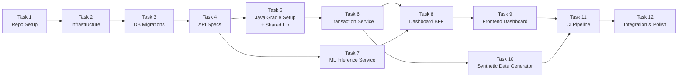

# Phase 1: Foundation (MVP) — Implementation Plan

> **Goal**: POST a transaction → it gets scored by Isolation Forest → result visible on dashboard. Everything runs in Docker Compose.
>
> **Not in scope for Phase 1**: Kafka, Flink, Autoencoder, Keycloak, RAG chatbot, WebSocket, MLflow, multi-tenancy, Novu notifications, k6 load tests. These come in later phases.

---

## Prerequisites

Ensure the following are installed on the development machine:

| Tool | Version | Purpose |
|------|---------|---------|
| Git | 2.40+ | Version control |
| Docker + Docker Compose | 24+ / v2 | Containerization |
| Java (Temurin JDK) | 21 | Spring Boot services |
| Gradle | 8.x (via wrapper) | Java builds |
| Python | 3.12+ | ML services |
| uv | latest | Python package management |
| Node.js | 22 LTS | Frontend |
| pnpm | 9.x | Frontend package management |

---

## Task Sequence Overview



> [!IMPORTANT]
> Each task corresponds to exactly one feature branch and one PR. Tasks are merged sequentially into `develop`. Every PR must pass CI before merging.

---

## Task 1: Repository Setup

**Branch**: `feature/repo-setup`
**Depends on**: Nothing (first task)

### What We're Doing

Setting up the monorepo structure, git configuration, developer tooling, and the Makefile. This is the skeleton everything else builds on.

### Files to Create

#### 1.1 `.gitignore`

```gitignore
# === Java ===
*.class
*.jar
*.war
*.ear
build/
.gradle/
!gradle/wrapper/gradle-wrapper.jar
out/

# === Python ===
__pycache__/
*.py[cod]
*$py.class
*.egg-info/
dist/
.eggs/
*.egg
.venv/
venv/

# === Node / Frontend ===
node_modules/
.next/
.turbo/
out/

# === IDE ===
.idea/
*.iml
.vscode/
*.swp
*.swo
.DS_Store

# === Environment ===
.env
.env.local
.env.*.local
!.env.example

# === Docker ===
docker-compose.override.yml

# === ML ===
*.pkl
*.joblib
*.h5
*.pt
*.pth
mlruns/
mlartifacts/

# === Misc ===
*.log
tmp/
coverage/
.coverage
htmlcov/
```

#### 1.2 `.editorconfig`

```ini
root = true

[*]
indent_style = space
indent_size = 4
end_of_line = lf
charset = utf-8
trim_trailing_whitespace = true
insert_final_newline = true

[*.{yaml,yml,json}]
indent_size = 2

[*.{ts,tsx,js,jsx,css}]
indent_size = 2

[*.md]
trim_trailing_whitespace = false

[Makefile]
indent_style = tab
```

#### 1.3 `.pre-commit-config.yaml`

```yaml
repos:
  - repo: https://github.com/pre-commit/pre-commit-hooks
    rev: v4.6.0
    hooks:
      - id: trailing-whitespace
      - id: end-of-file-fixer
      - id: check-yaml
        args: [--allow-multiple-documents]
      - id: check-json
      - id: check-merge-conflict
      - id: check-added-large-files
        args: [--maxkb=1000]
      - id: no-commit-to-branch
        args: [--branch, main]

  - repo: https://github.com/compilerla/conventional-pre-commit
    rev: v3.4.0
    hooks:
      - id: conventional-pre-commit
        stages: [commit-msg]
        args: [feat, fix, refactor, docs, ci, test, chore, perf, build]
```

#### 1.4 `Makefile`

Create the full Makefile as described in the architecture doc (Section 10 of `architecture_discussion.md`). At minimum for Phase 1:

```makefile
.PHONY: help infra-up infra-down dev-all build-java build-python build-frontend \
        test-java test-python test-frontend test-all lint db-migrate db-seed \
        api-validate api-generate clean

help: ## Show this help
	@grep -E '^[a-zA-Z_-]+:.*?## .*$$' $(MAKEFILE_LIST) | sort | \
		awk 'BEGIN {FS = ":.*?## "}; {printf "\033[36m%-20s\033[0m %s\n", $$1, $$2}'

# ============================================
# INFRASTRUCTURE
# ============================================
infra-up: ## Start infrastructure (PostgreSQL, Redis)
	docker compose -f infrastructure/docker/docker-compose.infra.yml up -d
	@echo "Waiting for PostgreSQL to be ready..."
	@sleep 3
	@echo "Infrastructure is up."

infra-down: ## Stop infrastructure
	docker compose -f infrastructure/docker/docker-compose.infra.yml down

dev-all: ## Start all services via Docker Compose
	docker compose -f infrastructure/docker/docker-compose.yml up --build

dev-all-detached: ## Start all services in background
	docker compose -f infrastructure/docker/docker-compose.yml up --build -d

stop-all: ## Stop all services
	docker compose -f infrastructure/docker/docker-compose.yml down

# ============================================
# BUILD
# ============================================
build-java: ## Build all Java services
	cd services && ./gradlew build -x test

build-python: ## Install Python ML services in dev mode
	cd ml-services/inference-service && uv pip install -e ".[dev]"

build-frontend: ## Build frontend
	cd frontend && pnpm install && pnpm build

build-all: build-java build-python build-frontend ## Build everything

# ============================================
# TEST
# ============================================
test-java: ## Run Java tests
	cd services && ./gradlew test

test-python: ## Run Python tests
	cd ml-services/inference-service && pytest tests/ -v

test-frontend: ## Run frontend tests
	cd frontend && pnpm test

test-all: test-java test-python test-frontend ## Run all tests

# ============================================
# LINT & FORMAT
# ============================================
lint: ## Lint all code
	cd services && ./gradlew spotlessCheck
	cd ml-services && ruff check .
	cd frontend && pnpm lint

format: ## Format all code
	cd services && ./gradlew spotlessApply
	cd ml-services && ruff format .
	cd frontend && pnpm format

# ============================================
# DATABASE
# ============================================
db-migrate: ## Run Liquibase migrations
	cd services && ./gradlew :transaction-service:update

db-seed: ## Seed development data
	python ml-services/training-pipeline/scripts/generate_synthetic_data.py --seed-db

# ============================================
# API SPECS
# ============================================
api-validate: ## Validate OpenAPI specifications
	@echo "Validating API specs..."
	npx @redocly/cli lint api-specs/*.yaml

# ============================================
# CLEAN
# ============================================
clean: ## Clean all build artifacts
	cd services && ./gradlew clean
	rm -rf frontend/.next frontend/node_modules
	find ml-services -type d -name __pycache__ -exec rm -rf {} + 2>/dev/null || true
```

#### 1.5 `README.md`

A comprehensive project README with:
- Project description (what Lynceus is)
- Architecture overview (link to docs)
- Tech stack table
- Quick start guide (`make infra-up && make dev-all`)
- Project structure overview
- Contributing guidelines (link to `CONTRIBUTING.md`)
- License

#### 1.6 Directory Structure Scaffolding

Create all empty directories with `.gitkeep` files:

```
api-specs/shared/schemas/.gitkeep
services/.gitkeep
ml-services/inference-service/.gitkeep
ml-services/training-pipeline/.gitkeep
flink-jobs/.gitkeep
frontend/.gitkeep
infrastructure/docker/.gitkeep
infrastructure/nginx/.gitkeep
infrastructure/db/migrations/.gitkeep
infrastructure/helm/.gitkeep
infrastructure/keycloak/.gitkeep
infrastructure/scripts/.gitkeep
load-tests/.gitkeep
docs/architecture/decisions/.gitkeep
docs/api/.gitkeep
docs/runbooks/.gitkeep
```

### Commits

```bash
git init
git checkout -b main
git add .gitignore .editorconfig README.md AGENTS.md CLAUDE.md
git commit -m "chore: initialize repository with core configuration files"

git add .pre-commit-config.yaml Makefile
git commit -m "chore: add pre-commit hooks and Makefile developer workflow"

git add api-specs/ services/ ml-services/ flink-jobs/ frontend/ infrastructure/ load-tests/ docs/
git commit -m "chore: scaffold monorepo directory structure"

git checkout -b develop
```

### Verification

```bash
# Pre-commit hooks install
pre-commit install
pre-commit install --hook-type commit-msg

# Verify Makefile
make help
```

---

## Task 2: Infrastructure Foundation

**Branch**: `feature/infrastructure-foundation`
**Depends on**: Task 1

### What We're Doing

Setting up Docker Compose files for infrastructure (PostgreSQL 17 + pgvector, Redis) and the NGINX reverse proxy. After this task, `make infra-up` gives you a running database and cache.

### Files to Create

#### 2.1 `infrastructure/docker/.env.example`

```env
# PostgreSQL
POSTGRES_USER=lynceus
POSTGRES_PASSWORD=lynceus_dev_password
POSTGRES_DB=lynceus
POSTGRES_PORT=5432

# Redis
REDIS_PORT=6379
REDIS_PASSWORD=redis_dev_password

# NGINX
NGINX_PORT=8080

# Service Ports
TXN_SERVICE_PORT=8081
INFERENCE_SERVICE_PORT=8082
BFF_SERVICE_PORT=8083

# Phase 1: Services call each other directly
# Phase 2+: Services communicate via Kafka
TXN_SERVICE_URL=http://transaction-service:8081
INFERENCE_SERVICE_URL=http://inference-service:8082
BFF_SERVICE_URL=http://dashboard-bff:8083
```

#### 2.2 `infrastructure/docker/docker-compose.infra.yml`

Infrastructure-only compose file. Services:

| Service | Image | Ports | Purpose |
|---------|-------|-------|---------|
| `postgres` | `pgvector/pgvector:pg17` | 5432 | PostgreSQL 17 + pgvector extension |
| `redis` | `redis:7-alpine` | 6379 | Cache + feature store |

Configuration details:
- PostgreSQL: Mount an init script that creates the `pgvector` extension and configures `pg_stat_statements`
- PostgreSQL: Named volume `lynceus-pgdata` for persistence
- Redis: Append-only file persistence, password-protected
- Redis: Named volume `lynceus-redisdata` for persistence
- Both services on a `lynceus-network` bridge network
- Health checks on both services

#### 2.3 `infrastructure/docker/postgres/init.sql`

PostgreSQL initialization script (runs on first container start):

```sql
-- Enable extensions required by Lynceus.
-- pgvector: vector similarity search for RAG chatbot embeddings
-- pg_stat_statements: query performance monitoring for identifying slow queries
CREATE EXTENSION IF NOT EXISTS vector;
CREATE EXTENSION IF NOT EXISTS pg_stat_statements;
CREATE EXTENSION IF NOT EXISTS pg_trgm;

-- Development-only: create a default tenant for local development.
-- Production tenants are managed by Keycloak realm provisioning (Phase 2+).
```

#### 2.4 `infrastructure/docker/docker-compose.yml`

Full-stack compose file. Extends `docker-compose.infra.yml` and adds:

| Service | Build Context | Ports | Depends On |
|---------|--------------|-------|-----------|
| `nginx` | `infrastructure/nginx/` | 8080 | transaction-service, dashboard-bff |
| `transaction-service` | `services/transaction-service/` | 8081 | postgres, redis |
| `inference-service` | `ml-services/inference-service/` | 8082 | redis |
| `dashboard-bff` | `services/dashboard-bff/` | 8083 | postgres, redis |
| `frontend` | `frontend/` | 3000 | dashboard-bff |

All services join `lynceus-network`. All services have health checks. Services wait for dependencies via `depends_on` with `condition: service_healthy`.

#### 2.5 `infrastructure/nginx/nginx.conf`

NGINX configuration as reverse proxy:

```nginx
upstream transaction_service {
    server transaction-service:8081;
}

upstream inference_service {
    server inference-service:8082;
}

upstream dashboard_bff {
    server dashboard-bff:8083;
}

upstream frontend {
    server frontend:3000;
}

server {
    listen 8080;
    server_name localhost;

    # API routes → backend services
    location /api/v1/transactions {
        proxy_pass http://transaction_service;
        proxy_set_header Host $host;
        proxy_set_header X-Real-IP $remote_addr;
        proxy_set_header X-Request-ID $request_id;
    }

    location /api/v1/scoring {
        proxy_pass http://inference_service;
        proxy_set_header Host $host;
        proxy_set_header X-Real-IP $remote_addr;
        proxy_set_header X-Request-ID $request_id;
    }

    location /api/v1/dashboard {
        proxy_pass http://dashboard_bff;
        proxy_set_header Host $host;
        proxy_set_header X-Real-IP $remote_addr;
        proxy_set_header X-Request-ID $request_id;
    }

    # Frontend → Next.js
    location / {
        proxy_pass http://frontend;
        proxy_set_header Host $host;
        proxy_set_header X-Real-IP $remote_addr;
    }

    # Health check endpoint
    location /health {
        return 200 'OK';
        add_header Content-Type text/plain;
    }
}
```

#### 2.6 `infrastructure/nginx/Dockerfile`

```dockerfile
FROM nginx:1.27-alpine
COPY nginx.conf /etc/nginx/conf.d/default.conf
EXPOSE 8080
```

### Commits

```bash
git checkout develop && git checkout -b feature/infrastructure-foundation

# Commit 1: Docker Compose infrastructure
git add infrastructure/docker/
git commit -m "chore(infra): add Docker Compose for PostgreSQL 17 and Redis"

# Commit 2: NGINX reverse proxy
git add infrastructure/nginx/
git commit -m "chore(infra): add NGINX reverse proxy configuration"
```

### Verification

```bash
make infra-up
# Verify PostgreSQL is running and pgvector is installed:
docker exec -it lynceus-postgres psql -U lynceus -d lynceus -c "SELECT * FROM pg_extension WHERE extname = 'vector';"
# Verify Redis is running:
docker exec -it lynceus-redis redis-cli -a redis_dev_password ping
make infra-down
```

---

## Task 3: Database Migrations (Liquibase)

**Branch**: `feature/database-migrations`
**Depends on**: Task 2

### What We're Doing

Setting up Liquibase for schema management and creating the initial database tables for Phase 1: `transactions`, `fraud_scores`, and supporting indexes.

### Files to Create

#### 3.1 `infrastructure/db/migrations/db.changelog-master.yaml`

The root changelog that includes all migration files in order:

```yaml
databaseChangeLog:
  - include:
      file: changelogs/20260802-01-create-transactions-table.yaml
      relativeToChangelogFile: true
  - include:
      file: changelogs/20260802-02-create-fraud-scores-table.yaml
      relativeToChangelogFile: true
  - include:
      file: changelogs/20260802-03-create-indexes.yaml
      relativeToChangelogFile: true
```

#### 3.2 `infrastructure/db/migrations/changelogs/20260802-01-create-transactions-table.yaml`

Create the `transactions` table with:
- All columns from the schema in the architecture doc (Section 8)
- `tenant_id` column (VARCHAR 50, NOT NULL) — even in Phase 1 we use a default tenant `default` for forward compatibility
- `created_at` and `updated_at` TIMESTAMPTZ columns with defaults
- UUID primary key with `gen_random_uuid()` default
- `amount_bucket` generated column
- **No partitioning yet** — we add partitioning in Phase 2 when we have enough data to justify it. Phase 1 uses a simple table.
- JSONB `metadata` column for extensibility

#### 3.3 `infrastructure/db/migrations/changelogs/20260802-02-create-fraud-scores-table.yaml`

Create the `fraud_scores` table with:
- UUID primary key
- `tenant_id` column
- `transaction_id` UUID foreign key → `transactions(id)`
- `isolation_forest_score` DECIMAL(5,4) — Phase 1 only has this model
- `autoencoder_score` DECIMAL(5,4) NULLABLE — filled in Phase 2
- `ensemble_score` DECIMAL(5,4) NOT NULL
- `risk_level` VARCHAR(20) NOT NULL — computed from score thresholds
- `model_version` VARCHAR(50)
- `feature_vector` JSONB — snapshot of features used for this scoring
- `explanation` JSONB NULLABLE — SHAP values, added in Phase 3
- `scored_at` TIMESTAMPTZ

#### 3.4 `infrastructure/db/migrations/changelogs/20260802-03-create-indexes.yaml`

Create indexes:
- `idx_txn_tenant_created` on `transactions(tenant_id, created_at DESC)` — dashboard queries
- `idx_txn_tenant_customer` on `transactions(tenant_id, customer_id)` — customer lookups
- `idx_txn_merchant_cat` on `transactions(tenant_id, merchant_category)` — analytics
- `idx_txn_metadata` GIN index on `transactions(metadata)` — JSONB queries
- `idx_fraud_scores_txn` on `fraud_scores(transaction_id)` — join optimization
- `idx_fraud_scores_tenant_risk` on `fraud_scores(tenant_id, risk_level)` — alert filtering

### Integration with Spring Boot

Liquibase will be integrated into the Transaction Service (Task 6) via Spring Boot's auto-configuration. The service runs migrations on startup. The changelog path is configured in `application.yml`:

```yaml
spring:
  liquibase:
    change-log: classpath:db/changelog/db.changelog-master.yaml
```

The migration files will be copied/symlinked into the service's `src/main/resources/db/changelog/` directory.

### Commits

```bash
git checkout develop && git checkout -b feature/database-migrations

git add infrastructure/db/migrations/
git commit -m "chore(infra): add Liquibase changelog and initial schema migrations"
```

### Verification

```bash
make infra-up
# Run migrations via a temporary Liquibase container:
docker run --rm --network lynceus-network \
  -v $(pwd)/infrastructure/db/migrations:/liquibase/changelog \
  liquibase/liquibase:latest \
  --url=jdbc:postgresql://postgres:5432/lynceus \
  --username=lynceus \
  --password=lynceus_dev_password \
  --changelog-file=changelog/db.changelog-master.yaml \
  update

# Verify tables exist:
docker exec -it lynceus-postgres psql -U lynceus -d lynceus -c "\dt"
```

---

## Task 4: OpenAPI Specifications

**Branch**: `feature/api-specifications`
**Depends on**: Task 1 (directory structure)

### What We're Doing

Defining the API contracts for all Phase 1 services BEFORE writing any service code. These specs are the source of truth.

### Files to Create

#### 4.1 `api-specs/shared/schemas/transaction.yaml`

Reusable schema components:

- **`Transaction`** — full transaction object (all fields from DB schema)
- **`CreateTransactionRequest`** — request body for creating a transaction (subset of fields — no id, timestamps, or generated columns)
- **`TransactionSummary`** — lightweight version for list views (id, amount, merchant, risk_level, created_at)
- **`TransactionListResponse`** — paginated list with `items`, `total`, `page`, `page_size`

#### 4.2 `api-specs/shared/schemas/fraud-score.yaml`

- **`FraudScore`** — full fraud score object
- **`ScoreTransactionRequest`** — request to score a transaction (transaction data + feature vector)
- **`ScoreTransactionResponse`** — response with scores, risk level, model version

#### 4.3 `api-specs/shared/errors.yaml`

- **`ErrorResponse`** — standard error format with `code`, `message`, `details`, `trace_id`, `timestamp`
- Common error responses: `400`, `401`, `403`, `404`, `422`, `429`, `500`

#### 4.4 `api-specs/transaction-api.yaml`

**Transaction Service API** — OpenAPI 3.1 spec

| Method | Path | Description | Request | Response |
|--------|------|-------------|---------|----------|
| `POST` | `/api/v1/transactions` | Create a new transaction | `CreateTransactionRequest` | `201` → `Transaction` |
| `GET` | `/api/v1/transactions/{id}` | Get transaction by ID | Path param: `id` | `200` → `Transaction` (with fraud score if scored) |
| `GET` | `/api/v1/transactions` | List transactions (paginated) | Query: `page`, `page_size`, `risk_level`, `merchant_category`, `date_from`, `date_to` | `200` → `TransactionListResponse` |

- Tag: `Transactions`
- Server: `http://localhost:8081`
- All endpoints include `X-Tenant-Id` header (required)

#### 4.5 `api-specs/inference-api.yaml`

**ML Inference Service API** — OpenAPI 3.1 spec

| Method | Path | Description | Request | Response |
|--------|------|-------------|---------|----------|
| `POST` | `/api/v1/scoring/score` | Score a single transaction | `ScoreTransactionRequest` | `200` → `ScoreTransactionResponse` |
| `POST` | `/api/v1/scoring/batch` | Score multiple transactions | Array of `ScoreTransactionRequest` | `200` → Array of `ScoreTransactionResponse` |
| `GET` | `/api/v1/scoring/health` | Health check | — | `200` → `{ "status": "healthy", "model_version": "..." }` |

- Tag: `Scoring`
- Server: `http://localhost:8082`

#### 4.6 `api-specs/dashboard-bff-api.yaml`

**Dashboard BFF API** — OpenAPI 3.1 spec

| Method | Path | Description | Response |
|--------|------|-------------|----------|
| `GET` | `/api/v1/dashboard/overview` | Dashboard KPIs | Total txns, fraud rate, avg score, flagged count, amount summaries |
| `GET` | `/api/v1/dashboard/transactions/recent` | Recent transactions with scores | Paginated list of transactions + their fraud scores |
| `GET` | `/api/v1/dashboard/fraud-distribution` | Score distribution for histogram | Buckets with counts |
| `GET` | `/api/v1/dashboard/risk-breakdown` | Risk level breakdown | Counts per risk level |
| `GET` | `/api/v1/dashboard/timeline` | Fraud score over time | Time-series data points |

- Tag: `Dashboard`
- Server: `http://localhost:8083`

### Commits

```bash
git checkout develop && git checkout -b feature/api-specifications

git add api-specs/shared/
git commit -m "docs(api-spec): add shared schema components for transactions and fraud scores"

git add api-specs/transaction-api.yaml
git commit -m "docs(api-spec): define Transaction Service API contract"

git add api-specs/inference-api.yaml
git commit -m "docs(api-spec): define ML Inference Service API contract"

git add api-specs/dashboard-bff-api.yaml
git commit -m "docs(api-spec): define Dashboard BFF API contract"
```

### Verification

```bash
make api-validate
# Should pass with no errors
```

---

## Task 5: Java Gradle Multi-Module Setup + Shared Library

**Branch**: `feature/java-gradle-setup`
**Depends on**: Task 4

### What We're Doing

Setting up the Gradle multi-module build for all Java services and creating the shared library with common DTOs, exception handling, and utilities.

### Files to Create

#### 5.1 `services/build.gradle.kts` (Root Build)

Root Gradle build with:
- `java` plugin
- `spring-boot` plugin (applied to subprojects, not root)
- Java 21 toolchain configuration
- Common dependency versions managed via a version catalog (`libs.versions.toml`)
- Spotless plugin for code formatting (Google Java Format)
- Subproject configuration: common dependencies (SLF4J, Lombok, JUnit 5, Mockito)

#### 5.2 `services/settings.gradle.kts`

```kotlin
rootProject.name = "lynceus-services"

include(
    "shared-lib",
    "transaction-service",
    "dashboard-bff"
    // alert-service and customer-service added in Phase 2
)
```

#### 5.3 `services/gradle/libs.versions.toml`

Version catalog with:
- `spring-boot = "3.4.x"` (latest stable)
- `spring-dependency-management = "1.1.x"`
- `lombok = "1.18.x"`
- `mapstruct = "1.6.x"`
- `liquibase = "4.x"`
- `postgresql-driver = "42.7.x"`
- `redis-lettuce` (via Spring Boot)
- `jackson` (via Spring Boot)
- `spotless = "7.x"`
- `testcontainers = "1.20.x"`

#### 5.4 `services/gradle/wrapper/*`

Gradle wrapper (generated via `gradle wrapper --gradle-version 8.x`)

#### 5.5 `services/shared-lib/build.gradle.kts`

Shared library build file. This is a plain Java library (no Spring Boot plugin). Dependencies:
- `jakarta.validation-api`
- `jackson-annotations`
- `lombok`
- Spring Web (for `@ResponseStatus` etc.)

#### 5.6 `services/shared-lib/src/main/java/com/lynceus/shared/`

**DTOs (generated from OpenAPI in the future, hand-written for now):**

| Class | Purpose |
|-------|---------|
| `dto/TransactionDto.java` | Record — full transaction representation |
| `dto/CreateTransactionRequest.java` | Record — transaction creation request with validation annotations |
| `dto/TransactionSummaryDto.java` | Record — lightweight transaction for lists |
| `dto/FraudScoreDto.java` | Record — fraud score result |
| `dto/ScoreTransactionRequest.java` | Record — request to the inference service |
| `dto/ScoreTransactionResponse.java` | Record — response from the inference service |
| `dto/PagedResponse.java` | Generic record — paginated response wrapper |
| `dto/ErrorResponse.java` | Record — standardized error response |

**Exception handling:**

| Class | Purpose |
|-------|---------|
| `exception/ResourceNotFoundException.java` | Thrown when entity not found (maps to 404) |
| `exception/ValidationException.java` | Thrown for business rule violations (maps to 422) |
| `exception/ServiceUnavailableException.java` | Thrown when downstream service is down (maps to 503) |
| `exception/GlobalExceptionHandler.java` | `@RestControllerAdvice` — catches all exceptions, returns `ErrorResponse` |

**Utilities:**

| Class | Purpose |
|-------|---------|
| `util/TenantContext.java` | Thread-local holder for current tenant ID. Set by a filter, read by repositories. |
| `config/TenantFilter.java` | Servlet filter that extracts `X-Tenant-Id` header and sets `TenantContext`. In Phase 1 defaults to `"default"`. |

### Commits

```bash
git checkout develop && git checkout -b feature/java-gradle-setup

git add services/build.gradle.kts services/settings.gradle.kts services/gradle/
git commit -m "build(shared): initialize Gradle multi-module project with version catalog"

git add services/shared-lib/
git commit -m "feat(shared): add shared DTOs, exception handling, and tenant context utilities"
```

### Verification

```bash
cd services && ./gradlew build
# Should compile successfully with 0 errors
cd services && ./gradlew test
# Should pass (shared-lib unit tests)
```

---

## Task 6: Transaction Service

**Branch**: `feature/transaction-service`
**Depends on**: Task 3 (migrations), Task 5 (shared lib)

### What We're Doing

The core service: accepts transaction data via REST API, persists to PostgreSQL, calls the ML Inference Service synchronously for scoring (Phase 1 only — Phase 2 switches to Kafka), and caches scored results in Redis.

### Files to Create

#### 6.1 `services/transaction-service/build.gradle.kts`

Dependencies:
- `shared-lib` (project dependency)
- `spring-boot-starter-web`
- `spring-boot-starter-data-jpa`
- `spring-boot-starter-data-redis`
- `spring-boot-starter-validation`
- `spring-boot-starter-actuator`
- `liquibase-core`
- `postgresql` driver
- `mapstruct` + `mapstruct-processor`
- `lombok`
- Test: `spring-boot-starter-test`, `testcontainers` (postgresql, redis)

#### 6.2 `services/transaction-service/src/main/resources/application.yml`

```yaml
server:
  port: 8081

spring:
  application:
    name: transaction-service
  datasource:
    url: jdbc:postgresql://${POSTGRES_HOST:localhost}:${POSTGRES_PORT:5432}/${POSTGRES_DB:lynceus}
    username: ${POSTGRES_USER:lynceus}
    password: ${POSTGRES_PASSWORD:lynceus_dev_password}
    driver-class-name: org.postgresql.Driver
  jpa:
    hibernate:
      ddl-auto: validate  # Liquibase manages schema — Hibernate only validates
    properties:
      hibernate:
        dialect: org.hibernate.dialect.PostgreSQLDialect
        default_schema: public
  liquibase:
    change-log: classpath:db/changelog/db.changelog-master.yaml
  data:
    redis:
      host: ${REDIS_HOST:localhost}
      port: ${REDIS_PORT:6379}
      password: ${REDIS_PASSWORD:redis_dev_password}

# Phase 1: Direct HTTP call to inference service
# Phase 2: This is replaced by Kafka producer
lynceus:
  inference-service:
    url: ${INFERENCE_SERVICE_URL:http://localhost:8082}
  tenant:
    default-tenant-id: default

management:
  endpoints:
    web:
      exposure:
        include: health, info, prometheus
  endpoint:
    health:
      show-details: always
```

#### 6.3 Source Code Structure

```
services/transaction-service/src/main/java/com/lynceus/transaction/
├── TransactionServiceApplication.java     # @SpringBootApplication
├── config/
│   ├── RedisConfig.java                   # Redis template + cache configuration
│   ├── RestClientConfig.java              # RestClient bean for calling inference service
│   └── WebConfig.java                     # Register TenantFilter
├── controller/
│   └── TransactionController.java         # REST endpoints (POST, GET, GET list)
├── service/
│   ├── TransactionService.java            # Core business logic
│   └── InferenceClient.java               # HTTP client to call inference service for scoring
├── repository/
│   └── TransactionRepository.java         # Spring Data JPA repository
├── model/
│   ├── entity/
│   │   ├── Transaction.java               # JPA entity
│   │   └── FraudScore.java                # JPA entity
│   └── mapper/
│       └── TransactionMapper.java         # MapStruct: entity ↔ DTO
└── exception/
    └── TransactionExceptionHandler.java   # Service-specific exception handling (extends global)
```

#### 6.4 Key Implementation Details

**`TransactionController`**:
- `POST /api/v1/transactions`: Validates input → calls `TransactionService.create()` → returns `202 Accepted`
- `GET /api/v1/transactions/{id}`: Calls `TransactionService.findById()` → returns `200` with transaction + fraud score (if scored)
- `GET /api/v1/transactions`: Paginated list with filters (risk_level, merchant_category, date range). Uses Spring Data `Pageable`.

**`TransactionService`**:
- `create()`: Persist transaction → call `InferenceClient.score()` → persist fraud score → cache result in Redis → return response
- `findById()`: Check Redis cache first → fall back to DB
- In Phase 1, scoring is synchronous. Comment this clearly: `// Phase 1: Synchronous scoring. Phase 2 replaces this with Kafka event publishing.`

**`InferenceClient`**:
- Uses Spring's `RestClient` to call `POST /api/v1/scoring/score` on the inference service
- Includes timeout configuration (connect: 2s, read: 10s)
- Includes basic error handling (log + return unscored if inference is down — graceful degradation)

**`Transaction` entity**:
- Maps to `transactions` table
- All columns from the migration
- `@Column(name = "tenant_id")` — always filtered in queries
- `@PrePersist` sets `created_at` and `updated_at`

**`FraudScore` entity**:
- Maps to `fraud_scores` table
- `@ManyToOne` relationship to `Transaction`

**`TransactionRepository`**:
- Extends `JpaRepository<Transaction, UUID>`
- Custom queries with `@Query` annotation, always including `WHERE tenant_id = :tenantId`
- `findByTenantIdAndId()`, `findAllByTenantId(Pageable)`, filtered queries for risk level / merchant category / date range

#### 6.5 Dockerfile

```dockerfile
# Build stage
FROM eclipse-temurin:21-jdk-alpine AS build
WORKDIR /app
COPY gradle/ gradle/
COPY gradlew build.gradle.kts settings.gradle.kts gradle/libs.versions.toml ./
COPY shared-lib/ shared-lib/
COPY transaction-service/ transaction-service/
RUN ./gradlew :transaction-service:bootJar --no-daemon

# Runtime stage
FROM eclipse-temurin:21-jre-alpine
RUN addgroup -S lynceus && adduser -S lynceus -G lynceus
WORKDIR /app
COPY --from=build /app/transaction-service/build/libs/*.jar app.jar
USER lynceus
EXPOSE 8081
HEALTHCHECK --interval=30s --timeout=3s --retries=3 \
    CMD wget -qO- http://localhost:8081/actuator/health || exit 1
ENTRYPOINT ["java", "-jar", "app.jar"]
```

#### 6.6 Liquibase Integration

Copy (or symlink) the migration files from `infrastructure/db/migrations/` into `services/transaction-service/src/main/resources/db/changelog/`. The Transaction Service is the schema owner — it runs migrations on startup.

#### 6.7 Tests

**Unit tests** (`src/test/java/com/lynceus/transaction/`):
- `service/TransactionServiceTest.java` — test create, findById, list logic with mocked repository and inference client
- `controller/TransactionControllerTest.java` — `@WebMvcTest` to test controller layer in isolation

**Integration tests**:
- `TransactionServiceIntegrationTest.java` — `@SpringBootTest` + Testcontainers (PostgreSQL, Redis). Tests full flow: create → score → retrieve.

### Commits

```bash
git checkout develop && git checkout -b feature/transaction-service

git add services/transaction-service/build.gradle.kts
git add services/transaction-service/src/main/resources/
git commit -m "build(txn-svc): add build config and application properties"

git add services/transaction-service/src/main/java/**/model/
git commit -m "feat(txn-svc): add Transaction and FraudScore JPA entities"

git add services/transaction-service/src/main/java/**/repository/
git commit -m "feat(txn-svc): add transaction repository with tenant-scoped queries"

git add services/transaction-service/src/main/java/**/service/
git commit -m "feat(txn-svc): add transaction service with synchronous scoring"

git add services/transaction-service/src/main/java/**/controller/
git commit -m "feat(txn-svc): add REST controller for transaction CRUD"

git add services/transaction-service/src/main/java/**/config/
git commit -m "feat(txn-svc): add Redis, RestClient, and web configuration"

git add services/transaction-service/Dockerfile
git commit -m "build(txn-svc): add multi-stage Dockerfile"

git add services/transaction-service/src/test/
git commit -m "test(txn-svc): add unit and integration tests"
```

### Verification

```bash
cd services && ./gradlew :transaction-service:test
# All tests pass

make infra-up
cd services && ./gradlew :transaction-service:bootRun
# Service starts on port 8081
# Test endpoints:
curl -X POST http://localhost:8081/api/v1/transactions \
  -H "Content-Type: application/json" \
  -H "X-Tenant-Id: default" \
  -d '{"customer_id": "...", "amount": 150.00, "merchant_category": "electronics", ...}'
# Returns 202 (scoring will fail gracefully since inference service isn't running yet)
```

---

## Task 7: ML Inference Service

**Branch**: `feature/inference-service`
**Depends on**: Task 4 (API spec)

> [!NOTE]
> This task is independent of Tasks 5-6 (Java setup + Transaction Service) and can be developed in parallel.

### What We're Doing

Building the Python FastAPI service that loads a pre-trained Isolation Forest model and scores transactions. Includes a training script to create the initial model from synthetic data.

### Files to Create

#### 7.1 `ml-services/inference-service/pyproject.toml`

```toml
[project]
name = "lynceus-inference-service"
version = "0.1.0"
description = "ML Inference Service for Lynceus Fraud Detection"
requires-python = ">=3.12"
dependencies = [
    "fastapi>=0.115.0",
    "uvicorn[standard]>=0.30.0",
    "pydantic>=2.9.0",
    "pydantic-settings>=2.5.0",
    "scikit-learn>=1.5.0",
    "numpy>=2.0.0",
    "pandas>=2.2.0",
    "joblib>=1.4.0",
    "redis>=5.0.0",
    "structlog>=24.0.0",
    "httpx>=0.27.0",
]

[project.optional-dependencies]
dev = [
    "pytest>=8.0.0",
    "pytest-asyncio>=0.24.0",
    "httpx>=0.27.0",
    "ruff>=0.6.0",
    "mypy>=1.11.0",
]

[tool.ruff]
target-version = "py312"
line-length = 100

[tool.ruff.lint]
select = ["E", "F", "W", "I", "N", "UP", "B", "A", "SIM"]

[tool.pytest.ini_options]
asyncio_mode = "auto"
testpaths = ["tests"]
```

#### 7.2 Source Code Structure

```
ml-services/inference-service/
├── src/inference_service/
│   ├── __init__.py
│   ├── main.py                    # FastAPI app factory + lifespan (model loading)
│   ├── api/
│   │   ├── __init__.py
│   │   ├── routes/
│   │   │   ├── __init__.py
│   │   │   ├── scoring.py         # POST /score, POST /batch
│   │   │   └── health.py          # GET /health
│   │   └── deps.py                # Dependency injection (model, redis, config)
│   ├── core/
│   │   ├── __init__.py
│   │   ├── config.py              # Pydantic BaseSettings
│   │   └── exceptions.py          # Custom exceptions
│   ├── models/
│   │   ├── __init__.py
│   │   ├── isolation_forest.py    # Model wrapper: load, predict, explain
│   │   └── feature_engineer.py    # Feature extraction from raw transaction data
│   ├── schemas/
│   │   ├── __init__.py
│   │   ├── scoring.py             # Pydantic request/response models
│   │   └── health.py              # Health response model
│   └── services/
│       ├── __init__.py
│       └── scoring_service.py     # Orchestrates feature engineering + model inference
├── models/                        # Trained model artifacts (git-ignored, generated by training script)
│   └── .gitkeep
├── tests/
│   ├── __init__.py
│   ├── conftest.py
│   ├── unit/
│   │   ├── __init__.py
│   │   ├── test_feature_engineer.py
│   │   └── test_scoring_service.py
│   └── integration/
│       ├── __init__.py
│       └── test_scoring_api.py
├── Dockerfile
├── pyproject.toml
└── README.md
```

#### 7.3 Key Implementation Details

**`main.py`**:
- FastAPI app with lifespan context manager
- On startup: load the Isolation Forest model from disk (`models/isolation_forest.joblib`)
- Store model reference in `app.state` for dependency injection
- Configure CORS, structured logging

**`feature_engineer.py`**:
- `extract_features(transaction: ScoreTransactionRequest) -> np.ndarray`
- Extracts numerical features from raw transaction data:
  - `amount` (normalized)
  - `hour_of_day` (cyclical encoding: sin/cos)
  - `day_of_week` (cyclical encoding: sin/cos)
  - `is_online` (binary)
  - `is_foreign` (binary)
  - `merchant_category` (one-hot or ordinal encoded)
  - `amount_log` (log-transformed amount)
- Feature order MUST match training feature order exactly. This is enforced via a `FEATURE_COLUMNS` constant.

**`isolation_forest.py`**:
- `IsolationForestModel` class:
  - `load(path: str)` — load model from joblib file
  - `predict(features: np.ndarray) -> float` — returns anomaly score normalized to [0, 1]
  - scikit-learn's `decision_function` returns negative scores for anomalies → we normalize: `score = 1 - (raw_score - min) / (max - min)`

**`scoring_service.py`**:
- `ScoringService` class:
  - `score(request: ScoreTransactionRequest) -> ScoreTransactionResponse`
  - Calls `feature_engineer.extract_features()` → `model.predict()`
  - Computes `risk_level` from score thresholds: `<0.3` → low, `<0.5` → medium, `<0.7` → high, `≥0.7` → critical
  - Returns response with score, risk level, model version, feature snapshot
  - Uses `ProcessPoolExecutor` for CPU-bound inference to avoid blocking async event loop

**`scoring.py` (routes)**:
- `POST /api/v1/scoring/score` — single transaction scoring
- `POST /api/v1/scoring/batch` — batch scoring (list of transactions)
- Both use `Depends()` for model injection

#### 7.4 Dockerfile

```dockerfile
FROM python:3.12-slim AS build
WORKDIR /app
RUN pip install uv
COPY pyproject.toml .
RUN uv pip install --system -e "."

FROM python:3.12-slim
RUN groupadd -r lynceus && useradd -r -g lynceus lynceus
WORKDIR /app
COPY --from=build /usr/local/lib/python3.12/site-packages /usr/local/lib/python3.12/site-packages
COPY --from=build /usr/local/bin/uvicorn /usr/local/bin/uvicorn
COPY src/ src/
COPY models/ models/
USER lynceus
EXPOSE 8082
HEALTHCHECK --interval=30s --timeout=3s --retries=3 \
    CMD python -c "import httpx; httpx.get('http://localhost:8082/api/v1/scoring/health').raise_for_status()" || exit 1
ENTRYPOINT ["uvicorn", "src.inference_service.main:app", "--host", "0.0.0.0", "--port", "8082"]
```

#### 7.5 Tests

- **`test_feature_engineer.py`**: Verify feature extraction produces correct shape, handles edge cases (zero amount, missing fields)
- **`test_scoring_service.py`**: Mock model, verify scoring pipeline produces valid scores and risk levels
- **`test_scoring_api.py`**: Integration test using `httpx.AsyncClient`, verify full request → response cycle

### Commits

```bash
git checkout develop && git checkout -b feature/inference-service

git add ml-services/inference-service/pyproject.toml
git commit -m "build(inference-svc): add project configuration and dependencies"

git add ml-services/inference-service/src/inference_service/core/
git add ml-services/inference-service/src/inference_service/schemas/
git commit -m "feat(inference-svc): add configuration, schemas, and exception handling"

git add ml-services/inference-service/src/inference_service/models/
git commit -m "feat(inference-svc): add Isolation Forest model wrapper and feature engineering"

git add ml-services/inference-service/src/inference_service/services/
git commit -m "feat(inference-svc): add scoring service with process pool inference"

git add ml-services/inference-service/src/inference_service/api/
git add ml-services/inference-service/src/inference_service/main.py
git commit -m "feat(inference-svc): add FastAPI routes for scoring and health check"

git add ml-services/inference-service/Dockerfile
git commit -m "build(inference-svc): add multi-stage Dockerfile"

git add ml-services/inference-service/tests/
git commit -m "test(inference-svc): add unit and integration tests for scoring"
```

### Verification

```bash
cd ml-services/inference-service
uv venv && source .venv/bin/activate && uv pip install -e ".[dev]"
pytest tests/ -v
# All tests pass

# Run locally (will need a trained model — see Task 10)
uvicorn src.inference_service.main:app --reload --port 8082
```

---

## Task 8: Dashboard BFF Service

**Branch**: `feature/dashboard-bff`
**Depends on**: Task 5 (shared lib), Task 6 (transaction service running)

### What We're Doing

The Backend-For-Frontend that aggregates data from the Transaction Service (and in future phases, other services) into dashboard-friendly shapes. The frontend calls only this service.

### Files to Create

#### 8.1 Source Code Structure

```
services/dashboard-bff/
├── build.gradle.kts
├── src/main/java/com/lynceus/bff/
│   ├── DashboardBffApplication.java
│   ├── config/
│   │   ├── RedisConfig.java
│   │   ├── RestClientConfig.java           # RestClient beans for calling other services
│   │   └── WebConfig.java
│   ├── controller/
│   │   └── DashboardController.java        # All dashboard endpoints
│   ├── service/
│   │   ├── DashboardService.java           # Aggregation logic
│   │   └── TransactionClient.java          # HTTP client to Transaction Service
│   ├── model/
│   │   └── dto/
│   │       ├── OverviewResponse.java       # KPI cards data
│   │       ├── FraudDistributionResponse.java
│   │       ├── RiskBreakdownResponse.java
│   │       └── TimelineResponse.java
│   └── exception/
│       └── BffExceptionHandler.java
├── src/main/resources/
│   └── application.yml
├── src/test/java/
│   └── ...
└── Dockerfile
```

#### 8.2 Key Implementation Details

**`DashboardController`**:
- `GET /api/v1/dashboard/overview` — returns KPI metrics (total transactions, fraud rate, avg score, flagged count, total amount processed)
- `GET /api/v1/dashboard/transactions/recent` — paginated recent transactions with fraud scores
- `GET /api/v1/dashboard/fraud-distribution` — score distribution in 10 buckets (0.0-0.1, 0.1-0.2, ..., 0.9-1.0) with counts
- `GET /api/v1/dashboard/risk-breakdown` — count per risk level (low, medium, high, critical)
- `GET /api/v1/dashboard/timeline` — fraud score average per hour/day for time-series charts

**`DashboardService`**:
- Calls Transaction Service REST API to get data
- Aggregates and transforms data for dashboard consumption
- Caches overview and distribution results in Redis (TTL: 30 seconds for overview, 60 seconds for distribution)

**Caching strategy**:
- `overview` → Redis key `dashboard:overview:{tenant_id}`, TTL 30s
- `fraud-distribution` → Redis key `dashboard:fraud-dist:{tenant_id}`, TTL 60s
- `risk-breakdown` → Redis key `dashboard:risk-breakdown:{tenant_id}`, TTL 60s
- Recent transactions are NOT cached (must be fresh)

> [!NOTE]
> In Phase 1, the BFF calls the Transaction Service over HTTP. In Phase 2, it will also consume the `fraud.scored` Kafka topic directly for real-time feed.

### Commits

```bash
git checkout develop && git checkout -b feature/dashboard-bff

git add services/dashboard-bff/build.gradle.kts
git add services/dashboard-bff/src/main/resources/
git commit -m "build(bff): add build config and application properties"

git add services/dashboard-bff/src/main/java/
git commit -m "feat(bff): add dashboard aggregation service and REST endpoints"

git add services/dashboard-bff/Dockerfile
git commit -m "build(bff): add multi-stage Dockerfile"

git add services/dashboard-bff/src/test/
git commit -m "test(bff): add unit tests for dashboard aggregation logic"
```

### Verification

```bash
cd services && ./gradlew :dashboard-bff:test
# All tests pass

# Run locally (with Transaction Service and infra running):
cd services && ./gradlew :dashboard-bff:bootRun
curl http://localhost:8083/api/v1/dashboard/overview -H "X-Tenant-Id: default"
```

---

## Task 9: Frontend Dashboard (Turborepo + Next.js 16)

**Branch**: `feature/frontend-dashboard`
**Depends on**: Task 8 (BFF running)

### What We're Doing

Scaffolding the Turborepo monorepo with a Next.js 16 dashboard app. Phase 1 includes: overview page (KPI cards + charts), transactions page (data table), and a polished layout.

### Setup Commands

```bash
# Initialize Turborepo
cd frontend
npx -y create-turbo@latest ./ --example with-nextjs

# Or manual setup:
pnpm init
# Create turbo.json, workspace structure, etc.
```

### Directory Structure

```
frontend/
├── turbo.json
├── package.json
├── pnpm-workspace.yaml
├── apps/
│   └── dashboard/
│       ├── app/
│       │   ├── layout.tsx                 # Root layout: metadata, fonts, global styles
│       │   ├── page.tsx                   # Redirect to /overview
│       │   ├── globals.css                # Global styles + CSS custom properties (design tokens)
│       │   ├── overview/
│       │   │   ├── page.tsx               # Server Component: fetches overview data, renders KPIs + charts
│       │   │   └── loading.tsx            # Skeleton loading state
│       │   └── transactions/
│       │       ├── page.tsx               # Server Component: fetches transactions list
│       │       └── loading.tsx
│       ├── components/
│       │   ├── layout/
│       │   │   ├── sidebar.tsx            # Navigation sidebar
│       │   │   ├── header.tsx             # Top header with breadcrumbs
│       │   │   └── app-shell.tsx          # Layout wrapper (sidebar + content area)
│       │   ├── dashboard/
│       │   │   ├── kpi-card.tsx            # Metric card (value, label, trend arrow)
│       │   │   ├── fraud-distribution-chart.tsx  # Recharts histogram
│       │   │   ├── risk-breakdown-chart.tsx       # Recharts pie/donut
│       │   │   ├── timeline-chart.tsx             # Recharts line chart
│       │   │   └── recent-transactions.tsx        # Transaction table
│       │   └── ui/
│       │       ├── badge.tsx              # Risk level badge (color-coded)
│       │       ├── data-table.tsx          # Reusable table component
│       │       └── skeleton.tsx            # Loading skeleton
│       ├── lib/
│       │   ├── api.ts                     # API client (fetch wrapper for BFF)
│       │   └── utils.ts                   # Formatting helpers (currency, dates, percentages)
│       ├── types/
│       │   └── index.ts                   # TypeScript types (from API spec)
│       ├── next.config.ts
│       ├── package.json
│       └── tsconfig.json
└── packages/
    ├── ui/                                # Shared component library (empty in Phase 1, populated later)
    │   ├── package.json
    │   └── src/index.ts
    ├── config-eslint/
    │   └── package.json
    └── config-typescript/
        ├── base.json
        └── package.json
```

### Key Implementation Details

**Design system** (`globals.css`):
- CSS custom properties for colors, spacing, typography, shadows
- Dark mode by default (financial dashboards are always dark)
- Color palette: deep navy background, vibrant accent colors for risk levels
  - `--color-risk-low`: green
  - `--color-risk-medium`: amber/yellow
  - `--color-risk-high`: orange
  - `--color-risk-critical`: red
- Inter font from Google Fonts
- Smooth transitions on all interactive elements

**Overview page** (`/overview`):
- Server Component that fetches from BFF
- 4 KPI cards in a row: Total Transactions, Fraud Rate %, Average Score, Flagged Count
- Below: 2-column grid with Fraud Distribution histogram (Recharts BarChart) and Risk Breakdown donut (Recharts PieChart)
- Below: Timeline chart showing fraud score trend over time (Recharts AreaChart)
- Below: Recent transactions table (last 20, with risk level badges)

**Transactions page** (`/transactions`):
- Server Component with search params for pagination and filters
- Full data table with columns: ID (truncated), Amount, Merchant, Category, Risk Level, Score, Date
- Pagination controls
- Filter dropdowns: risk level, merchant category, date range

**API client** (`lib/api.ts`):
- Base URL from environment variable `NEXT_PUBLIC_API_URL` (defaults to `http://localhost:8080/api/v1`)
- Typed fetch functions: `getOverview()`, `getRecentTransactions()`, `getFraudDistribution()`, etc.
- Error handling with typed error responses

**SSR approach**:
- All pages are React Server Components by default
- Data fetching happens on the server via `fetch()` with `next: { revalidate: 30 }` for overview data
- No client-side state management in Phase 1 — everything is server-rendered
- Charts use `"use client"` since Recharts requires the browser

#### 9.1 Dockerfile

```dockerfile
FROM node:22-alpine AS deps
WORKDIR /app
RUN corepack enable && corepack prepare pnpm@latest --activate
COPY package.json pnpm-workspace.yaml pnpm-lock.yaml turbo.json ./
COPY apps/dashboard/package.json apps/dashboard/
COPY packages/ packages/
RUN pnpm install --frozen-lockfile

FROM node:22-alpine AS builder
WORKDIR /app
RUN corepack enable && corepack prepare pnpm@latest --activate
COPY --from=deps /app/node_modules ./node_modules
COPY --from=deps /app/apps/dashboard/node_modules ./apps/dashboard/node_modules
COPY . .
RUN pnpm --filter dashboard build

FROM node:22-alpine
RUN addgroup -S lynceus && adduser -S lynceus -G lynceus
WORKDIR /app
COPY --from=builder /app/apps/dashboard/.next/standalone ./
COPY --from=builder /app/apps/dashboard/.next/static ./apps/dashboard/.next/static
COPY --from=builder /app/apps/dashboard/public ./apps/dashboard/public
USER lynceus
EXPOSE 3000
ENV PORT=3000
ENTRYPOINT ["node", "apps/dashboard/server.js"]
```

### Commits

```bash
git checkout develop && git checkout -b feature/frontend-dashboard

git add frontend/package.json frontend/pnpm-workspace.yaml frontend/turbo.json
git add frontend/packages/
git commit -m "build(frontend): initialize Turborepo workspace with shared packages"

git add frontend/apps/dashboard/package.json frontend/apps/dashboard/next.config.ts
git add frontend/apps/dashboard/tsconfig.json
git commit -m "build(frontend): add Next.js 16 dashboard app configuration"

git add frontend/apps/dashboard/app/globals.css
git add frontend/apps/dashboard/app/layout.tsx
git add frontend/apps/dashboard/components/layout/
git commit -m "feat(frontend): add design system, root layout, and app shell"

git add frontend/apps/dashboard/lib/
git add frontend/apps/dashboard/types/
git commit -m "feat(frontend): add API client and TypeScript types"

git add frontend/apps/dashboard/components/dashboard/
git add frontend/apps/dashboard/components/ui/
git commit -m "feat(frontend): add dashboard components (KPI cards, charts, tables)"

git add frontend/apps/dashboard/app/overview/
git commit -m "feat(frontend): add overview page with KPIs and fraud charts"

git add frontend/apps/dashboard/app/transactions/
git commit -m "feat(frontend): add transactions page with data table and filters"

git add frontend/apps/dashboard/Dockerfile
git commit -m "build(frontend): add multi-stage Dockerfile with standalone output"
```

### Verification

```bash
cd frontend && pnpm install && pnpm dev
# Dashboard runs on http://localhost:3000
# Navigate to /overview — should show layout (data will be empty until BFF is running)

# Full stack test:
make dev-all
# Open http://localhost:8080 — should show the dashboard through NGINX
```

---

## Task 10: Synthetic Data Generator + Model Training

**Branch**: `feature/data-generator`
**Depends on**: Task 7 (inference service needs a trained model)

### What We're Doing

Creating a Python script that generates realistic synthetic transaction data with configurable fraud patterns, and a training script that trains the initial Isolation Forest model.

### Files to Create

```
ml-services/training-pipeline/
├── scripts/
│   ├── generate_synthetic_data.py     # Generates realistic transaction CSV
│   ├── train_isolation_forest.py      # Trains IF model, saves to inference-service/models/
│   └── seed_database.py               # Loads generated data into PostgreSQL
├── configs/
│   └── data_generation.yaml           # Generation parameters (volume, fraud rate, etc.)
├── pyproject.toml
└── README.md
```

#### 10.1 `generate_synthetic_data.py`

Generates CSV with columns matching the `transactions` table schema. Features:

- **Customer profiles**: Generate N customers with realistic spending patterns (mean amount, preferred categories, home location)
- **Normal transactions**: Generated from customer profiles (amount ~ Normal(customer_mean, customer_std), categories from customer preferences, locations near home)
- **Fraud patterns** (configurable percentage, default 2%):
  - **High-amount anomaly**: Amount 5-10x customer's mean
  - **Velocity burst**: 5+ transactions within 1 hour (normal is 1-2/day)
  - **Geographic impossibility**: Transaction 1000+ km from previous transaction within 1 hour
  - **Category anomaly**: Transaction in a category the customer has never used
  - **Late-night surge**: Cluster of transactions between 2-5 AM
- **Labels**: A `is_fraud` column (used for training evaluation, not available in production)
- **Output**: `data/synthetic_transactions.csv` (default: 100K transactions, 200 customers, 2% fraud)

#### 10.2 `train_isolation_forest.py`

- Loads synthetic data
- Applies the same feature engineering as `inference-service/src/.../feature_engineer.py` (shared logic or identical implementation)
- Trains `sklearn.ensemble.IsolationForest` with hyperparameters:
  - `n_estimators=200`
  - `contamination=0.02` (matches fraud rate)
  - `max_samples='auto'`
  - `random_state=42`
- Evaluates on labeled data: precision, recall, F1, ROC-AUC
- Saves model to `ml-services/inference-service/models/isolation_forest.joblib`
- Saves feature column list to `ml-services/inference-service/models/feature_columns.json`
- Prints evaluation metrics

#### 10.3 `seed_database.py`

- Reads generated CSV
- Connects to PostgreSQL (connection string from env var)
- Bulk inserts transactions using `COPY` protocol (psycopg `copy_from` for speed)
- Sets `tenant_id = 'default'` on all records

#### 10.4 `configs/data_generation.yaml`

```yaml
generation:
  num_customers: 200
  num_transactions: 100000
  fraud_rate: 0.02
  date_range:
    start: "2026-01-01"
    end: "2026-08-01"
  seed: 42

merchants:
  categories:
    - grocery
    - electronics
    - gas_station
    - restaurant
    - online_shopping
    - travel
    - entertainment
    - healthcare
    - utilities
    - clothing

fraud_patterns:
  high_amount:
    multiplier_range: [5, 10]
    weight: 0.3
  velocity_burst:
    min_transactions: 5
    window_hours: 1
    weight: 0.2
  geographic_impossibility:
    min_distance_km: 1000
    max_time_hours: 1
    weight: 0.2
  category_anomaly:
    weight: 0.15
  late_night:
    hour_range: [2, 5]
    weight: 0.15
```

### Commits

```bash
git checkout develop && git checkout -b feature/data-generator

git add ml-services/training-pipeline/pyproject.toml
git add ml-services/training-pipeline/configs/
git commit -m "build(ml): add training pipeline project config and data generation parameters"

git add ml-services/training-pipeline/scripts/generate_synthetic_data.py
git commit -m "feat(ml): add synthetic transaction data generator with configurable fraud patterns"

git add ml-services/training-pipeline/scripts/train_isolation_forest.py
git commit -m "feat(ml): add Isolation Forest training script with evaluation metrics"

git add ml-services/training-pipeline/scripts/seed_database.py
git commit -m "feat(ml): add database seeding script using COPY protocol for bulk loading"
```

### Verification

```bash
cd ml-services/training-pipeline
python scripts/generate_synthetic_data.py
# Produces data/synthetic_transactions.csv (100K rows)

python scripts/train_isolation_forest.py
# Prints evaluation metrics
# Saves model to ../inference-service/models/isolation_forest.joblib

make infra-up
python scripts/seed_database.py
# Seeds PostgreSQL with synthetic data

# Verify data in database:
docker exec -it lynceus-postgres psql -U lynceus -d lynceus -c "SELECT COUNT(*) FROM transactions;"
# Should show 100000
```

---

## Task 11: CI Pipeline (GitHub Actions)

**Branch**: `feature/ci-pipeline`
**Depends on**: Tasks 6, 7, 9 (services exist to lint/test/build)

### What We're Doing

Setting up GitHub Actions CI that runs on every PR to `develop`. Lints, tests, and builds Docker images for all services.

### Files to Create

#### 11.1 `.github/workflows/ci.yml`

```yaml
name: CI

on:
  pull_request:
    branches: [develop, main]
  push:
    branches: [develop]

jobs:
  # =============================================
  # JAVA SERVICES
  # =============================================
  java-lint-test:
    name: Java — Lint & Test
    runs-on: ubuntu-latest
    services:
      postgres:
        image: pgvector/pgvector:pg17
        env:
          POSTGRES_USER: lynceus
          POSTGRES_PASSWORD: test_password
          POSTGRES_DB: lynceus_test
        ports: [5432:5432]
        options: >-
          --health-cmd pg_isready
          --health-interval 10s
          --health-timeout 5s
          --health-retries 5
      redis:
        image: redis:7-alpine
        ports: [6379:6379]
        options: >-
          --health-cmd "redis-cli ping"
          --health-interval 10s
          --health-timeout 5s
          --health-retries 5
    steps:
      - uses: actions/checkout@v4
      - uses: actions/setup-java@v4
        with:
          distribution: temurin
          java-version: 21
      - uses: gradle/actions/setup-gradle@v4
      - name: Lint
        run: cd services && ./gradlew spotlessCheck
      - name: Test
        run: cd services && ./gradlew test
        env:
          POSTGRES_HOST: localhost
          POSTGRES_PORT: 5432
          POSTGRES_DB: lynceus_test
          POSTGRES_USER: lynceus
          POSTGRES_PASSWORD: test_password
          REDIS_HOST: localhost
          REDIS_PORT: 6379

  # =============================================
  # PYTHON ML SERVICES
  # =============================================
  python-lint-test:
    name: Python — Lint & Test
    runs-on: ubuntu-latest
    steps:
      - uses: actions/checkout@v4
      - uses: actions/setup-python@v5
        with:
          python-version: "3.12"
      - name: Install uv
        run: pip install uv
      - name: Install dependencies
        run: |
          cd ml-services/inference-service
          uv venv
          source .venv/bin/activate
          uv pip install -e ".[dev]"
      - name: Lint
        run: |
          cd ml-services
          ruff check .
      - name: Type check
        run: |
          cd ml-services/inference-service
          source .venv/bin/activate
          mypy src/
      - name: Test
        run: |
          cd ml-services/inference-service
          source .venv/bin/activate
          pytest tests/ -v

  # =============================================
  # FRONTEND
  # =============================================
  frontend-lint-test:
    name: Frontend — Lint & Type Check
    runs-on: ubuntu-latest
    steps:
      - uses: actions/checkout@v4
      - uses: actions/setup-node@v4
        with:
          node-version: 22
      - uses: pnpm/action-setup@v4
        with:
          version: 9
      - name: Install dependencies
        run: cd frontend && pnpm install --frozen-lockfile
      - name: Lint
        run: cd frontend && pnpm lint
      - name: Type check
        run: cd frontend && pnpm type-check
      - name: Build
        run: cd frontend && pnpm build

  # =============================================
  # DOCKER BUILDS
  # =============================================
  docker-build:
    name: Docker — Build Images
    runs-on: ubuntu-latest
    needs: [java-lint-test, python-lint-test, frontend-lint-test]
    strategy:
      matrix:
        service:
          - { name: transaction-service, context: services, dockerfile: services/transaction-service/Dockerfile }
          - { name: inference-service, context: ml-services/inference-service, dockerfile: ml-services/inference-service/Dockerfile }
          - { name: dashboard-bff, context: services, dockerfile: services/dashboard-bff/Dockerfile }
          - { name: frontend, context: frontend, dockerfile: frontend/apps/dashboard/Dockerfile }
    steps:
      - uses: actions/checkout@v4
      - uses: docker/setup-buildx-action@v3
      - name: Build ${{ matrix.service.name }}
        uses: docker/build-push-action@v6
        with:
          context: ${{ matrix.service.context }}
          file: ${{ matrix.service.dockerfile }}
          push: false
          tags: lynceus/${{ matrix.service.name }}:ci
          cache-from: type=gha
          cache-to: type=gha,mode=max

  # =============================================
  # API SPEC VALIDATION
  # =============================================
  api-specs:
    name: Validate OpenAPI Specs
    runs-on: ubuntu-latest
    steps:
      - uses: actions/checkout@v4
      - uses: actions/setup-node@v4
        with:
          node-version: 22
      - name: Validate specs
        run: npx @redocly/cli lint api-specs/*.yaml
```

#### 11.2 `.github/pull_request_template.md`

```markdown
## Description

<!-- What does this PR do? Link to relevant issue/task. -->

## Type of Change

- [ ] `feat` — New feature
- [ ] `fix` — Bug fix
- [ ] `refactor` — Code refactoring
- [ ] `docs` — Documentation
- [ ] `test` — Test changes
- [ ] `ci` — CI/CD changes
- [ ] `chore` — Build, config, tooling

## Checklist

- [ ] Code follows project coding standards (see `AGENTS.md`)
- [ ] Self-reviewed the code
- [ ] Added/updated tests
- [ ] All tests pass locally
- [ ] No secrets or credentials committed
- [ ] Commit messages follow conventional commits
- [ ] API changes documented in OpenAPI specs (if applicable)
- [ ] Liquibase migration added (if DB changes)
```

### Commits

```bash
git checkout develop && git checkout -b feature/ci-pipeline

git add .github/workflows/ci.yml
git commit -m "ci: add GitHub Actions CI pipeline for Java, Python, and frontend"

git add .github/pull_request_template.md
git commit -m "ci: add PR template with checklist"
```

### Verification

```bash
# Push branch to GitHub and verify CI runs
git push -u origin feature/ci-pipeline
# Check GitHub Actions tab for green builds
```

---

## Task 12: Integration & End-to-End Verification

**Branch**: `feature/phase1-integration`
**Depends on**: All previous tasks merged to `develop`

### What We're Doing

Final integration: ensure all services work together end-to-end in Docker Compose. Fix any integration issues. Update documentation.

### Steps

1. **Merge all feature branches to `develop`** (in order: T1→T2→T3→T4→T5→T6→T7→T8→T9→T10→T11)

2. **Generate and train the model**:
   ```bash
   cd ml-services/training-pipeline
   python scripts/generate_synthetic_data.py
   python scripts/train_isolation_forest.py
   ```

3. **Start the full stack**:
   ```bash
   make dev-all
   ```

4. **Verify each service**:
   ```bash
   # NGINX health
   curl http://localhost:8080/health

   # Transaction Service
   curl http://localhost:8080/api/v1/transactions \
     -H "X-Tenant-Id: default" | head

   # Create a transaction (should be scored)
   curl -X POST http://localhost:8080/api/v1/transactions \
     -H "Content-Type: application/json" \
     -H "X-Tenant-Id: default" \
     -d '{
       "customer_id": "550e8400-e29b-41d4-a716-446655440000",
       "amount": 15000.00,
       "merchant_name": "Suspicious Electronics Store",
       "merchant_category": "electronics",
       "is_online": true,
       "is_foreign": true,
       "channel": "online"
     }'
   # Should return 202 with fraud score

   # Dashboard BFF
   curl http://localhost:8080/api/v1/dashboard/overview \
     -H "X-Tenant-Id: default"

   # ML Inference health
   curl http://localhost:8080/api/v1/scoring/health

   # Frontend
   # Open http://localhost:8080 in browser
   # Navigate to /overview — should show KPI cards and charts with seeded data
   # Navigate to /transactions — should show transaction list with scores
   ```

5. **Seed the database** (if not done already):
   ```bash
   make db-seed
   ```

6. **Update `README.md`** with:
   - Quick start instructions that actually work
   - Screenshots of the dashboard
   - Architecture diagram (embed from docs)
   - Link to API specs

7. **Create `docs/architecture/decisions/001-polyglot-services.md`** (first ADR):
   - Title: Use Java Spring Boot for business services, Python for ML services
   - Status: Accepted
   - Context: Why polyglot?
   - Decision: Java for high-throughput business logic (virtual threads, type safety, Spring ecosystem), Python for ML (scikit-learn, PyTorch, FastAPI)
   - Consequences: Two build systems, two deployment pipelines, but optimal language for each domain

### Commits

```bash
git checkout develop && git checkout -b feature/phase1-integration

# Fix any integration issues discovered during testing
git commit -m "fix(infra): adjust Docker Compose service dependencies and health checks"

# Update README
git commit -m "docs: update README with quick start guide and architecture overview"

# Add first ADR
git commit -m "docs: add ADR-001 polyglot services decision"
```

### Final Verification Checklist

- [ ] `make infra-up` starts PostgreSQL and Redis
- [ ] `make dev-all` starts all services + NGINX + frontend
- [ ] PostgreSQL has pgvector extension installed
- [ ] Liquibase migrations run successfully on Transaction Service startup
- [ ] `POST /api/v1/transactions` creates a transaction and returns a fraud score
- [ ] `GET /api/v1/transactions` returns paginated results
- [ ] `GET /api/v1/dashboard/overview` returns KPI data
- [ ] Dashboard loads in browser at `http://localhost:8080`
- [ ] Overview page shows KPI cards and charts with seeded data
- [ ] Transactions page shows data table with risk level badges
- [ ] All risk levels display with correct color coding
- [ ] CI pipeline passes on GitHub Actions
- [ ] `make lint` passes for all languages
- [ ] `make test-all` passes

---

## Release

After all verification passes:

```bash
# Merge develop to main and tag
git checkout main
git merge develop
git tag -a v0.1.0 -m "Phase 1: Foundation MVP — Transaction scoring with Isolation Forest, Next.js dashboard"
git push origin main --tags
```

---

## Phase 1 Summary

### What We've Built

| Component | Status |
|-----------|--------|
| Monorepo structure with Makefile | ✅ |
| Git workflow (branching, conventional commits, pre-commit) | ✅ |
| OpenAPI specs for 3 services | ✅ |
| Docker Compose (PG17 + pgvector, Redis, NGINX) | ✅ |
| Liquibase migrations (transactions, fraud_scores) | ✅ |
| Transaction Service (Spring Boot) | ✅ |
| ML Inference Service (FastAPI + Isolation Forest) | ✅ |
| Dashboard BFF (Spring Boot) | ✅ |
| Frontend Dashboard (Next.js 16 + Turborepo + Recharts) | ✅ |
| Synthetic data generator + model training | ✅ |
| CI pipeline (GitHub Actions) | ✅ |

### What's NOT Built Yet (Phase 2+)

| Component | Phase |
|-----------|-------|
| Apache Kafka event bus | Phase 2 |
| Async event-driven scoring | Phase 2 |
| Autoencoder model + ensemble scoring | Phase 2 |
| Keycloak authentication | Phase 2 |
| Multi-tenancy (beyond default tenant) | Phase 2 |
| Alert Service | Phase 2 |
| Customer Profile Service | Phase 2 |
| MLflow model registry | Phase 2 |
| WebSocket live feed | Phase 2 |
| Apache Flink stream processing | Phase 3 |
| Redis Feature Store | Phase 3 |
| SHAP explainability | Phase 3 |
| Human-in-the-loop feedback | Phase 3 |
| Graph fraud detection | Phase 3 |
| RAG Chatbot + pgvector | Phase 4 |
| OpenTelemetry distributed tracing | Phase 5 |
| Prometheus + Grafana monitoring | Phase 5 |
| Kubernetes Helm charts | Phase 5 |
| k6 load testing | Phase 5 |
| Novu notifications | Phase 2 |
